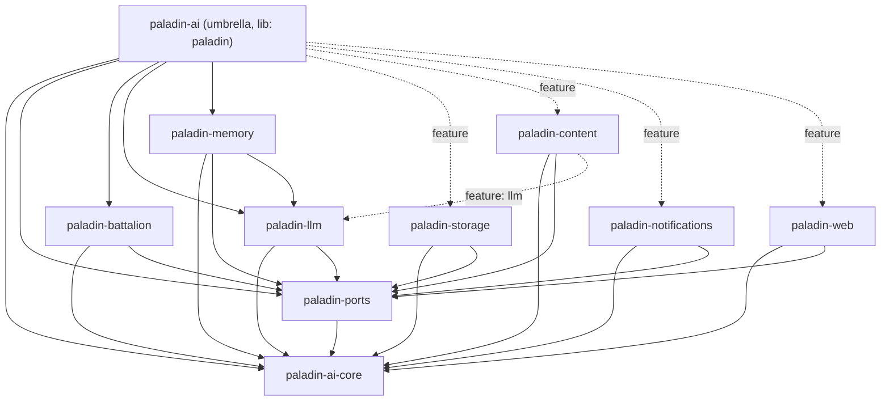

# Crate Map & Feature-Flag Reference

This page is the **consumer/dependency view** of the Paladin workspace: which
crates exist, what each one is published as, how they depend on one another,
every Cargo feature flag, and copy-paste `Cargo.toml` profiles for common setups.

For the **architecture-layer view** (module-by-module breakdown, hexagonal
boundaries, "adding a new crate"), see
[Architecture → Crate Map](../architecture/crate-map.md). For the canonical
per-flag default table, see [Feature Flags](feature-flags.md).

> All versions on this page target the **current published workspace, v0.10.0**.

## Workspace Crate Table

The workspace is a single umbrella crate (`paladin-ai`, published lib name
`paladin`) plus eleven member crates under `crates/`. Note that `paladin-core`'s
**published package name is `paladin-ai-core`** (the directory is
`crates/paladin-core` and the `lib` name is `paladin_core`).

| Crate (package) | Directory | Layer | Purpose | Key exports |
|---|---|---|---|---|
| `paladin-ai-core` | `crates/paladin-core` | Core domain | Pure domain types, zero infrastructure deps | `Node<T>`, `Paladin`, `PaladinConfig`, `Battalion`, `BattalionConfig`, `Garrison`, `Arsenal`, `Herald`, `Sanctum`, `Trigger` |
| `paladin-ports` | `crates/paladin-ports` | Application boundary | Port trait contracts (hexagonal interfaces) | `LlmPort`, `GarrisonPort`, `SanctumPort`, `ArsenalPort`, `OrchestratorPort`, `FullQueuePort`, `NotificationDeliveryPort`, `FileStoragePort`, `EmbeddingPort`, `PaladinExecutorPort`, `BattalionPort` |
| `paladin-battalion` | `crates/paladin-battalion` | Application services | Multi-agent orchestration runtime | `FormationExecutionService`, `PhalanxExecutionService`, `CampaignExecutionService`, `ChainOfCommandExecutionService`, `Commander`, `CommanderBuilder`, `ConclaveExecutionService`, `CouncilExecutionService`, `GroveExecutionService`, `ManeuverExecutionService` |
| `paladin-llm` | `crates/paladin-llm` | Infrastructure | LLM provider adapters | `OpenAIAdapter`, `AnthropicAdapter`, `DeepSeekAdapter`, `MockLlmAdapter`, `LlmProviderFactory` |
| `paladin-memory` | `crates/paladin-memory` | Infrastructure | Garrison (history) + Sanctum (vector) adapters | `InMemoryGarrison`, `SqliteGarrison`, `InMemorySanctum`, `QdrantSanctumAdapter` |
| `paladin-storage` | `crates/paladin-storage` | Infrastructure | SQL repository adapters (SQLite / MySQL / Postgres) | `SqliteContentRepository`, `SqliteUserRepository`, `SqliteWorkflowRepository`, `MysqlContentRepository` |
| `paladin-content` | `crates/paladin-content` | Infrastructure | Content ingestion & processing pipeline | `PdfExtractor`, `HttpContentFetcher`, `NewsApiFetcher`, `AggregateContent`, `ContentSummarizer`, `LlmContentAnalyzer`, `DeliverContentUseCase` |
| `paladin-notifications` | `crates/paladin-notifications` | Infrastructure | Notification delivery adapters | `EmailNotificationAdapter`, `PushNotificationAdapter`, `SystemNotificationAdapter` |
| `paladin-web` | `crates/paladin-web` | Infrastructure | HTTP server layer (actix-web / axum) | `UserController`, auth middleware, content-delivery endpoints |
| `paladin-eval` | `crates/paladin-eval` | Composition (dev-dependency) | Deterministic evaluation harness for agent graphs | scenario file format, scripted `LlmPort`, trace-based assertions |
| `paladin-herald` | `crates/paladin-herald` | Infrastructure | Herald output-formatter adapters | JSON, Markdown, Table formatters |

The root umbrella crate **`paladin-ai`** (lib name `paladin`) re-exports the most
common types and gates every infrastructure crate behind feature flags — most
applications depend on `paladin-ai` rather than wiring the member crates by hand.

## Crate Dependency Graph

Every member crate depends only inward — on `paladin-ai-core` (domain) and/or
`paladin-ports` (contracts). No infrastructure crate depends on another
infrastructure crate, with two exceptions: `paladin-content` can pull in
`paladin-llm` (behind its `llm` feature) for AI content analysis, and
`paladin-memory` depends unconditionally on `paladin-llm` so
`RagRetrievalService` can ration its RAG injection budget through
`Commissary::dispense` (Phase 33, COMM-01).



Solid edges are unconditional dependencies; dashed edges are feature-gated. From
the umbrella crate, `paladin-storage`, `paladin-content`, `paladin-notifications`,
and `paladin-web` are **optional** dependencies enabled by feature flags
(`storage*`, `content-processing`, `notifications`, `web-server`).

## Feature-Flag Reference

### Root umbrella crate — `paladin-ai`

`default = ["llm-openai"]`.

| Feature flag | Enables | External / crate dependency gated |
|---|---|---|
| `llm-openai` *(default)* | OpenAI LLM provider | — |
| `llm-anthropic` | Anthropic LLM provider | — |
| `llm-deepseek` | DeepSeek LLM provider | — |
| `llm-all` | All three LLM providers | — |
| `vision` | Vision / multimodal extensions | — |
| `ml` | ML analysis subsystem | — |
| `redis-queue` | Redis-backed job queue | `redis` |
| `s3-storage` | MinIO / S3 file storage | `rust-s3` |
| `qdrant` | Qdrant vector store (Sanctum) | `qdrant-client`, `paladin-memory/qdrant` |
| `openai-embeddings` | OpenAI embedding API | `paladin-llm/openai-embeddings` |
| `content-processing` | Content pipeline (scraping, RSS, news, tokenization, LLM analysis) | `paladin-content` (+ `web-scraping`, `rss`, `news-api`, `tiktoken`, `llm`), `paladin-memory/content-processing` |
| `web-server` | HTTP server layer | `paladin-web` |
| `notifications` | Email / push / system notifications | `paladin-notifications` (+ `email`, `push`, `system`) |
| `storage-sqlite` | SQLite SQL repositories | `paladin-storage/sqlite` |
| `storage-mysql` | MySQL SQL repositories | `paladin-storage/mysql` |
| `storage` | Both SQLite and MySQL repositories | `storage-sqlite` + `storage-mysql` |
| `cli` | CLI binary & test tooling | `clap`, `dialoguer`, `indicatif`, `console`, `serde_yaml` |
| `full` | All optional features above | — |
| `integration-tests` | Enables integration-test gating | — |
| `live-api-tests` | Tests requiring real API keys | — |
| `vendored-openssl` | Statically build OpenSSL from source (cross-compiled release binaries) | `openssl` (vendored) |

### `paladin-llm`

`default = ["openai", "mock"]`.

| Feature flag | Enables | External dependency gated |
|---|---|---|
| `openai` *(default)* | `OpenAIAdapter`, embeddings adapter | `reqwest`, `rand` |
| `mock` *(default)* | `MockLlmAdapter`, `MultiStepMockLlmPort` | — |
| `anthropic` | `AnthropicAdapter` | `reqwest`, `rand` |
| `deepseek` | `DeepSeekAdapter` | `reqwest`, `rand` |
| `vision` | Vision / multimodal support | `base64` (implies `openai`) |
| `openai-embeddings` | Embedding API | implies `openai` |

### `paladin-memory`

`default = []`.

| Feature flag | Enables | External dependency gated |
|---|---|---|
| `sqlite` | `SqliteGarrison` | `sqlx` |
| `qdrant` | `QdrantSanctumAdapter` | `qdrant-client` |
| `content-processing` | Token counting for content pipeline | `tiktoken-rs` |

### `paladin-storage`

| Feature flag | Enables | External dependency gated |
|---|---|---|
| `sqlite` | SQLite repository adapters | `sqlx` (`sqlx/sqlite`) |
| `mysql` | MySQL repository adapters | `sqlx` (`sqlx/mysql`) |

### `paladin-content`

| Feature flag | Enables | External dependency gated |
|---|---|---|
| `pdf` | PDF extraction helpers | — (`pdf-extract` is always present) |
| `web-scraping` | *Reserved* — pulls in `scraper`; **no adapter implemented yet** | `scraper` |
| `rss` | *Reserved* — pulls in `rss`; **no adapter implemented yet** | `rss` |
| `news-api` | News API fetcher (`NewsApiFetcher`) | — |
| `tiktoken` | Token counting | `tiktoken-rs` |
| `llm` | LLM-powered content analysis | `paladin-llm` |

### `paladin-notifications`

| Feature flag | Enables | External dependency gated |
|---|---|---|
| `email` | SMTP email notifications + templating | `lettre`, `handlebars` |
| `push` | Push notification adapter | — |
| `system` | System notification adapter | — |

> `paladin-ai-core`, `paladin-ports`, `paladin-battalion`, and `paladin-web`
> expose **no feature flags** — they are always compiled in full.

## Consumer Profiles

Three ready-to-use dependency profiles for the umbrella crate, plus a granular
"member crates" option for fine-grained control.

### Minimal — single agent, in-memory + SQLite garrison, OpenAI

The defaults already include the OpenAI provider, the orchestration runtime, and
the in-memory/SQLite garrison — enough to build and run a single Paladin.

```toml
[dependencies]
paladin-ai = "0.10.0"   # default features: ["llm-openai"]
tokio = { version = "1", features = ["full"] }
```

### Standard — orchestration, multiple LLMs, SQLite storage, vector memory

```toml
[dependencies]
paladin-ai = { version = "0.10.0", features = [
    "llm-anthropic",   # add Anthropic alongside the default OpenAI
    "llm-deepseek",    # add DeepSeek
    "storage-sqlite",  # SQLite SQL repositories
    "qdrant",          # Qdrant-backed Sanctum vector memory
    "notifications",   # email / push / system notifications
] }
tokio = { version = "1", features = ["full"] }
```

### Full — everything enabled

```toml
[dependencies]
paladin-ai = { version = "0.10.0", features = ["full"] }
tokio = { version = "1", features = ["full"] }
```

The `full` feature pulls in all LLM providers, the content-processing pipeline,
the web server, notifications, both SQL backends, vision, Redis queue, S3
storage, OpenAI embeddings, Qdrant, and the CLI.

### Granular — depend on member crates directly

For consumers who want to avoid the umbrella crate and wire only what they need
(note the `package = "paladin-ai-core"` rename for the core crate):

```toml
[dependencies]
paladin-core = { package = "paladin-ai-core", version = "0.10.0" }
paladin-ports = "0.10.0"
paladin-battalion = "0.10.0"
paladin-llm = { version = "0.10.0", features = ["openai", "anthropic"] }
paladin-memory = { version = "0.10.0", features = ["sqlite"] }
tokio = { version = "1", features = ["full"] }
```

## See Also

- [Architecture → Crate Map](../architecture/crate-map.md) — module-level layout and hexagonal boundaries.
- [Feature Flags](feature-flags.md) — per-flag defaults and rationale.
- [Orchestration Patterns](../user-guides/orchestration.md) — using `paladin-battalion`.
- [Content Processing](../user-guides/content-processing.md) — using `paladin-content`.
