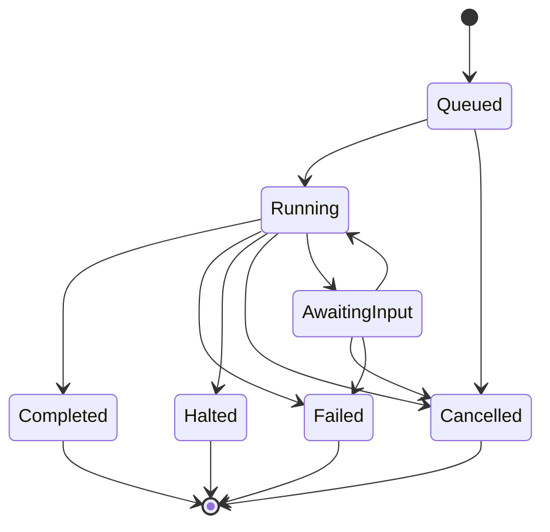

# Platform API — Runs, Threads, Assistants, Schedules, Webhooks

**Since:** v0.10.0 (PRD 06, Phase 27)
**Crates:** `paladin-web` (routes/DTOs), `paladin-ports` (port contracts), `paladin-core` (`Run`,
`RunSchedule`, `WebhookDelivery`), facade `src/application/services/run/*` (the durable worker
pool, streaming bus, schedule service, webhook delivery service)

`paladin-web` was, before this phase, a synchronous execute surface: `POST /agents/{id}/execute`
held the HTTP connection for the whole run. The Platform API turns it into a durable **run
server**: `POST /runs` enqueues and returns immediately, a worker pool drives the engine off the
request path, threads are inspectable and resumable over HTTP, assistants are named/versioned
configurations, schedules trigger runs on cron expressions, and webhooks notify on terminal
states.

Every subsystem below is disabled by default (X-09) — see [Configuration](#configuration) — so a
v0.9 deployment that never sets any of these env vars boots v0.10 identically to before, and every
route answers `501 not_implemented` (naming the config key to set) until an operator wires a
backend.

## Runs

### The status machine

A `Run`'s `status` is one of seven values, transitioned only through a pure, exhaustively-tested
state machine (`RunStatus::try_transition`). Every write is a compare-and-set (`UPDATE ... WHERE
status = ?from`), never a read-modify-write, so the invariant below holds under concurrent
workers with no application-level lock:



`Completed`, `Failed`, `Halted` and `Cancelled` are **absorbing terminals** — no edge ever leaves
one. An attempted illegal transition never silently no-ops; it returns a structured
`IllegalTransition { from, to }` error, surfaced as `409 conflict` over HTTP where applicable.

### Submitting a run

```
POST /v1/runs
{
  "assistant_id": "researcher",
  "version": null,            // omit to resolve `latest` at submit time (frozen on the run, D-30)
  "thread_id": null,          // omit to start a fresh thread
  "input": {},                // caller-supplied initial state; defaults to {}
  "webhook": {                // optional; validated by the SSRF guard before anything is persisted
    "url": "https://example.com/hooks/paladin",
    "secret": "whsec_...",
    "events": ["completed", "failed", "awaiting_input"]
  }
}
```

Returns `202 Accepted` with `{ run_id, thread_id, state_url }` — the handler performs exactly one
repository insert and one queue enqueue, with no engine work on the request path (PLAT-FR-01's
p99 ≤ 250ms budget is an architectural property of that fact, not a number to tune).

`GET /v1/runs/{run_id}` returns the full `Run`: `run_id`, `thread_id`, `assistant_id`, `version`,
`status`, `submitted_at`/`started_at`/`finished_at`, `error` (the engine's error, when `Failed`).

`GET /v1/runs?thread_id=&assistant_id=&status=&limit=&cursor=` lists runs
`(submitted_at DESC, run_id DESC)`, paginated per [Pagination](#pagination); a run's `webhook`
field, if echoed at all, always redacts `secret` to `"***"`.

**`409 thread_busy`.** Submitting to a thread whose latest run is `Queued`, `Running` **or
`AwaitingInput`** returns `409` — a deliberate tightening beyond the literal `Queued|Running` text
(D-18): a thread suspended awaiting input still has an active run, and admitting a second run onto
it would race a concurrent execution over the same Waypoint chain. The `409` body names
`POST /v1/threads/{thread_id}/resume` as the remedy.

### Cancelling a run

```
POST /v1/runs/{run_id}/cancel
```

Returns `202` and is **idempotent** on a non-terminal run (repeat calls are no-ops); `409
conflict` on an already-terminal run. Cancellation is persisted-flag-first: the durable cancel
flag is written through the repository, then the in-process `CancellationToken` is best-effort
signalled if the run happens to be local — durability first means a cancel is never lost to a
crash between the two steps, and a worker on a **different instance** observes the flag at the
next superstep boundary via a `CancellationProbe`.

The engine's own vocabulary and the run's status vocabulary deliberately differ at this boundary:
the **Waypoint** halted (`RunOutcome::Halted`), while the **run** is recorded `Cancelled`. A plain
graceful-shutdown drain (no cancel requested) also produces a `Halted` Waypoint, but the run stays
`Running` for immediate redelivery rather than moving to `Cancelled` — only an explicit
`POST .../cancel` produces the `Cancelled` run status.

### Streaming

```
GET /v1/runs/{run_id}/stream          (text/event-stream)
```

Seven wire event names are frozen for this milestone (D-25); every event also carries `seq`, `at`,
`mode` (`live` or `degraded`) and `dropped`:

| `event:` | `data:` payload |
|---|---|
| `superstep` | `{ superstep }` |
| `node_started` | `{ superstep, node_id }` |
| `node_finished` | `{ superstep, node_id, outcome }` |
| `state_delta` | `{ superstep, fields, bytes }` — changed field **names** and a byte-size count only, **never a value** |
| `parley` | `{ waypoint_id, parleys }` |
| `done` | `{ status, waypoint_id }` |
| `error` | `{ status, message, waypoint_id }` |

If the run is executing on **this** instance, live progress bridges from a `TraceSink` adapter
feeding a per-run broadcast bus (`superstep`/`node_started`/`node_finished`/`state_delta`), while
`parley`/`done`/`error` are published by the worker directly from the outcome it already matches
on. `done`/`error` are always eventually delivered on this path.

**Degraded mode is a documented, first-class path, not an error case.** If the run is executing on
another instance, or is already terminal, the handler synthesizes events by polling persisted
Waypoints instead. **The degraded path gives no ordering guarantee relative to the live path and
may coalesce multiple supersteps into a single observed jump** — it is a "catch up to current
state" view, not a live progress feed. `done`/`error` are still always eventually delivered on the
degraded path; only their timing and granularity relative to the live path are unspecified.

A 15-second heartbeat comment line is emitted on **both** paths to defeat idle-proxy timeouts.

## Threads

| Route | Behavior |
|---|---|
| `GET /v1/threads?limit=&cursor=` | Paginated thread summaries |
| `GET /v1/threads/{thread_id}` | A single thread's summary (404 if unknown) |
| `GET /v1/threads/{thread_id}/history` | Paginated Chronicle history: `?limit=20&cursor=...` (limit ≤ 100), `{ items, next_cursor }` |
| `GET /v1/threads/{thread_id}/state` | The thread's latest status, plus outstanding `parleys`/`responses` when suspended |
| `POST /v1/threads/{thread_id}/resume` | `{ "responses": [{ "parley_id", "value", "responded_by" }] }` → `202 { thread_id, state_url, run_id }` |
| `POST /v1/threads/{thread_id}/fork` | `{ "from_waypoint_id", "edit"? }` → submits a **new** run on the same thread from an earlier Waypoint, with `edit` applied → `202 { run_id, thread_id }`; `409 thread_busy` while a run is active |
| `DELETE /v1/threads/{thread_id}` | Admin-only; `204`; `409 thread_busy` while a run is active |

A resumed run re-enqueues under the **same `run_id`** (`attempt` incremented, D-23) rather than
spawning a new run — `ResumeAcceptedResponse.run_id` (added this phase, `#[non_exhaustive]`,
D-21) lets a caller poll `GET /v1/runs/{run_id}` directly after a resume instead of only
`GET .../state`. A thread with no run row (a pre-run-server thread) keeps the in-process spawn
fallback behavior unchanged.

> **Never template a secret or credential into a Gate's payload.** `GET /v1/threads/{id}/state`
> returns that payload verbatim to any authenticated caller.

## Assistants

An assistant is a named, versioned configuration: `Assistant { assistant_id, versions: [...],
latest }`. Each `AssistantVersion` wraps an `AssistantDefinition`:

```json
{ "kind": "agent", "body": { "...": "a Paladin config as data" } }
```

or

```json
{ "kind": "workflow", "body": { "...": "a WarGraphDoc, see the dedicated schema page" } }
```

— see [WarGraphDoc — the Workflow Assistant Document Format](wargraph-doc-schema.md) for the
`workflow` body's own shape.

| Route | Behavior |
|---|---|
| `POST /v1/assistants` | Admin; creates version 1; `201`/`400` + violation list/`409` (see below) |
| `GET /v1/assistants?limit=&cursor=` | Paginated; merges synthetic code-registry entries (see below) |
| `GET /v1/assistants/{assistant_id}` | A single assistant's summary |
| `DELETE /v1/assistants/{assistant_id}` | Admin; soft-delete; existing runs referencing it stay readable |
| `POST /v1/assistants/{assistant_id}/versions` | Admin; creates version `latest + 1` |
| `GET /v1/assistants/{assistant_id}/versions?limit=&cursor=` | Paginated changelog |
| `GET /v1/assistants/{assistant_id}/versions/{version}` | A single version |

**Publish-time validation is compile-time validation.** An `agent` body validates structurally
into a real Paladin config; a `workflow` body validates by deserializing to a `WarGraphDoc` and
calling its `compile()` against the server's live registries — a version that exists is a version
that runs. A failure returns `400` with a machine-readable violation list:

```json
{
  "error": {
    "code": "validation_failed",
    "message": "assistant definition failed validation",
    "details": [
      { "path": "/body/nodes/1/kind", "code": "unsupported_node_kind", "message": "kind \"function\" is not supported" }
    ]
  }
}
```

Nothing is persisted on a failed validation.

**Versions are immutable, by construction, not by handler discipline.** There is no `update`
method on the admin port and **no `PUT`/`PATCH` route is ever registered** for a version — the
router cannot express the operation. `POST /runs` without an explicit `version` resolves
`latest` and **freezes** it onto the run inside the same database transaction that inserts the
run row (D-30): a version published concurrently with a submit either lands strictly before (the
new run sees it) or strictly after (the run keeps the old one) — never a torn read.

**Code-registered agents are exposed as read-only synthetic assistants.** With
`assistants.expose_code_registry` at its default (`true`), every code-registered agent from the
existing `AgentRegistry` appears in `GET /assistants` as `{ assistant_id, latest: 1, source:
"code" }`, giving clients one discovery surface for both kinds. Every mutating route on a
code-registered id answers `409 code_registered_immutable` before the admin port is ever called.
**Known limitation:** the synthetic merge currently happens on the **first page only** — a full
cursor-walk across a paginated `GET /assistants` may omit code-registered entries past page one
(tracked in the project's defect ledger; not a security issue, since the entries are always
read-only regardless of whether they are listed).

## Schedules

```
POST /v1/schedules
{
  "assistant_id": "researcher",
  "version": null,                    // omit to resolve latest at each tick
  "cron": "0 */15 * * * *",           // 5- or 6-field (croner); optional leading seconds field
  "timezone": null,                   // an IANA name, or omit for UTC
  "input": {},
  "enabled": true,
  "thread_strategy": "new_thread_per_tick",   // or { "fixed_thread": "<thread_id>" }
  "on_missed": "skip",                        // or "run_once"
  "webhook": null
}
```

| Route | Behavior |
|---|---|
| `POST /v1/schedules` | Admin; `201`/`400` + violations/`403`/`501` |
| `GET /v1/schedules?limit=&cursor=` | Paginated |
| `GET /v1/schedules/{schedule_id}` | Includes `last_tick`/`next_tick`/`skipped_ticks` |
| `PATCH /v1/schedules/{schedule_id}` | Admin; every field optional, only present fields change |
| `DELETE /v1/schedules/{schedule_id}` | Admin |

**Cron semantics.** Standard 5-field cron, with an optional leading seconds field for 6-field
expressions; both forms compute identical next-occurrence instants. `timezone` defaults to UTC,
or names an IANA zone. `thread_strategy` controls whether each tick starts a fresh thread
(`new_thread_per_tick`, the default) or always targets the same thread (`fixed_thread`) — a
`fixed_thread` tick landing on a busy thread is **skipped**, and `skipped_ticks` on the schedule
row is incremented, so "why did nothing run" is answerable from `GET .../{id}` without a log dive.

**Restart- and replica-safety, without leader election.** A tick is *claimed* by a single
conditional `UPDATE ... WHERE schedule_id = ? AND next_tick = ?` — exactly one caller's update
affects the row, whether that caller is a second thread after a restart or a second replica
racing the same tick. `next_tick` is persisted, so a restart neither double-fires (the claim
already advanced it) nor fires-then-double-fires later. `on_missed` governs what happens when a
tick is discovered well past due: `skip` (default) recomputes `next_tick` from now without
submitting; `run_once` submits exactly once, then recomputes.

`ScheduleResponse.webhook.secret` always renders `"***"` (or `null` if unset) — the raw secret is
accepted on write but never echoed back.

## Webhooks

A run's or schedule's `webhook` spec `{ url, secret?, events }` subscribes to lifecycle events
(`awaiting_input`, `completed`, `failed`, `halted`, `cancelled`). Delivery is a **persisted
queue**, drained by a service — never a spawned task that would lose deliveries on restart —
proven under a race so each due delivery is claimed exactly once.

**Payload** (exactly this key set; no run input, no Battlefield state, no signing secret ever
appears):

```json
{
  "run_id": "...",
  "thread_id": "...",
  "assistant": { "assistant_id": "researcher", "version": 3 },
  "status": "completed",
  "event": "completed",
  "timestamp": "2026-09-08T12:00:00Z",
  "attempt": 1,
  "parleys": null
}
```

**Signature verification.** If `secret` is set, every delivery carries:

```
X-Paladin-Signature: sha256=<hex>
```

computed as HMAC-SHA256 over the **exact byte buffer that is sent** — never re-serialized between
signing and sending, so a receiver's own recomputation over the raw bytes it captured always
matches:

```text
signature = hex(hmac_sha256(key = secret, message = raw_request_body_bytes))
# Verify (pseudo-code, over the RAW bytes you received — never over a re-parsed/re-serialized copy):
expected = hex(hmac_sha256(key = your_stored_secret, message = raw_body_bytes))
assert constant_time_eq(expected, header_value_after_"sha256=")
```

**Retry schedule.** `2xx` is delivered. Any `3xx` (redirects are never followed — see below) or
`4xx` **dead-letters immediately** — the target itself is rejecting the payload, and a retry is
usually not the fix. A `5xx` response, a timeout, or a connect error retries with exponential
backoff — `1s, 2s, 4s, 8s, 16s` between successive attempts, capped at 60s — up to
`webhooks.max_attempts` (default `5`) total attempts, after which the delivery is dead-lettered. A
dead-lettered delivery stays queryable with its final status and response code.

```
GET /v1/runs/{run_id}/webhook-deliveries?limit=&cursor=
```

lists persisted delivery attempts newest-first: `attempt`, `status`, `next_attempt_at`,
`last_response_status`, `last_error` — the payload's signing secret is never included in the
response.

**The SSRF guard** is a standalone, table-tested function applied at **both** write time (when a
webhook URL is first accepted, e.g. `POST /runs`, `POST /schedules`) and send time (immediately
before every delivery attempt, since a hostname's resolution can change between the two). It
rejects:

- any scheme other than `http`/`https`;
- any host resolving to a **loopback** address;
- any host resolving to a **link-local** address (`169.254.0.0/16`, `fe80::/10`) — which covers
  the cloud metadata address `169.254.169.254`, **always rejected regardless of
  `allow_private`**;
- any host resolving to an **RFC1918** private address;
- any host resolving to a **unique-local** (`fc00::/7`) address;
- any host resolving to an **unspecified** address (`0.0.0.0`, `::`).

`webhooks.allow_private` (default `false`) is the **only** override, and it never overrides the
metadata-address rejection. The webhook HTTP client **never follows redirects** — a followed
redirect would both forward the `X-Paladin-Signature` credential header to an attacker-chosen host
and bypass the write-time check entirely, which is also why a `3xx` response dead-letters instead
of retrying.

**Known limitation, documented rather than implemented: DNS rebinding.** Neither the write-time
nor the send-time check *pins* the resolved address between the classification check and the
actual TCP connection the HTTP client makes. A hostname that answers a public address at check
time and a private/metadata address at connect time (classic DNS rebinding) is not defended
against by this guard alone — resolve-then-connect address pinning is not implemented in this
milestone. Naming this gap plainly is the point: PRD 06's own functional requirement explicitly
permits documenting it rather than closing it, and claiming coverage that does not exist would be
worse than the gap itself.

### Known limitations

**A run against a code-registered agent never fires a webhook.** Two assistant kinds resolve
through this API: a stored `WarGraphDoc` workflow, and a **code-registered agent** (a single
Paladin registered directly in the process, not backed by a Waypoint-tracked graph). The delivery
hook documented above — enqueueing a `Pending` webhook delivery on a lifecycle transition — is
wired only into the workflow path. A run submitted against a code-registered agent completes (or
fails) with a `webhook` spec attached, but **zero deliveries are ever enqueued for it**, no matter
which events it subscribed to; the same run's status is still correctly reported by
`GET /runs/{run_id}` and by the degraded polling path on `GET /runs/{run_id}/stream` (the live
SSE bus is excluded for this run kind too). If your integration depends on webhook delivery, poll
the run instead of relying on a callback when its assistant is code-registered. This is a
recorded, tested limitation, not a silent gap: it is pinned by a named test in the worker's own
test suite and tracked in the project's broken-windows ledger.

## Pagination

Every list endpoint (`/runs`, `/threads`, `/assistants`, `/assistants/{id}/versions`,
`/schedules`, `/runs/{id}/webhook-deliveries`) shares one shape:

```
?limit=20&cursor=<opaque>
```

- `limit` defaults to `20`; the valid range is `1..=100`. An out-of-range `limit` (`0` or `> 100`)
  returns `400 bad_request` — it is never silently clamped.
- `cursor` is an **opaque** token (encoding the last-seen row's key) — never parse or construct
  one client-side. A malformed, truncated or tampered cursor returns `400 bad_request` with a
  stable code, never a 500 and never a full-table scan.
- The response shape is always `{ items: [...], next_cursor }`; `next_cursor` is `null` when the
  page ends on the last row. An empty result set is `200 { items: [], next_cursor: null }` — never
  `404`, never a bare array.
- **Cursor pagination here gives a stable walk over rows that already existed when the first page
  was fetched, but it is not a snapshot:** rows inserted after the first page was fetched may be
  omitted from a subsequent page of the same walk. Treat a paginated list as "the state as of when
  you started paging," not a point-in-time snapshot.

## Authentication and scopes

Every new route sits behind the same authentication middleware and the same rate limiting
`/v1/agents/*` already uses. Mutating routes follow a two-tier convention (D-46), matching
`agent_controller`'s existing pattern rather than inventing a third:

| Shape | Routes | Gate |
|---|---|---|
| **Invocation-shaped** | run submit/cancel/resume/fork | `authorize_invoke` against the target assistant's `allowed_roles` — any authenticated principal the assistant itself permits |
| **Registry-shaped** | assistant create/publish-version/delete; schedule create/patch/delete; thread delete | `require_admin` — an admin-role credential |
| **Reads** | every `GET` | authentication only |

**What a `GET` can see today.** Every read route above needs authentication only — there is no
per-resource ownership check. Any authenticated principal of any role can call `GET /runs` and
`GET /runs/{run_id}` and see every run in the deployment, not just runs it submitted itself: the
resolved assistant and thread ids, status, error text, and — via
`GET /runs/{run_id}/webhook-deliveries` and the run's own `webhook` field — another caller's
webhook target URL (the signing secret is always redacted, the URL is not). `run_id` values are
time-ordered UUIDv7s, so walking `GET /runs` or guessing a nearby id is easier than for a random
identifier. This is the intended model for a **single-tenant or mutually-trusted-principal
deployment** — it is not a promise that one caller's runs are hidden from another. A
finer-grained, per-tenant read scope is the tracked remediation, not yet built.

## Configuration

Every subsystem below is its own config struct (`Default` + `validate()` + `EnvOverridable`),
loaded via `APP_`-prefixed environment variables, and **defaults to disabled/safe** so a v0.9
deployment boots v0.10 unchanged (X-09) — the sole deliberate exception is
`assistants.expose_code_registry`, which defaults **on** (see below).

| Struct | Env vars | Defaults |
|---|---|---|
| `run_store` | `APP_RUN_STORE_BACKEND` (`disabled`\|`sqlite`\|`postgres`), `APP_RUN_STORE_PATH`, `APP_RUN_STORE_URL_ENV` | `disabled` — every run route answers `501` until set |
| `run_queue` | `APP_RUN_QUEUE_BACKEND` (`in_memory`\|`redis`), `APP_RUN_QUEUE_URL_ENV`, `APP_RUN_QUEUE_KEY_PREFIX` | `in_memory` |
| `run_worker` | `APP_RUN_WORKER_CONCURRENCY`, `APP_RUN_WORKER_LEASE_SECONDS`, `APP_RUN_WORKER_MIN_PROBE_INTERVAL_MS` | `concurrency=4`, `lease_seconds=60` (heartbeat = `lease/4`, no separate knob), `min_probe_interval_ms=1000` |
| `run_stream` | `APP_RUN_STREAM_POLL_INTERVAL_MS` | `poll_interval_ms=1000` (degraded-path polling only) |
| `assistants` | `APP_ASSISTANTS_EXPOSE_CODE_REGISTRY` | `expose_code_registry=true` — the one deliberate exception to "off by default": the exposed data is read-only and was already discoverable via the pre-existing `AgentRegistry`, so this only unifies the read surface |
| `schedules` | `APP_SCHEDULES_ENABLED`, `APP_SCHEDULES_TICK_INTERVAL_MS` | `enabled=false`, `tick_interval_ms=1000` |
| `webhooks` | `APP_WEBHOOKS_ALLOW_PRIVATE`, `APP_WEBHOOKS_MAX_ATTEMPTS`, `APP_WEBHOOKS_TIMEOUT_SECS` | `allow_private=false`, `max_attempts=5`, `timeout_secs=10` |

`run_store`'s `postgres` variant, and `run_queue`'s `redis` variant, each carry the **name** of an
environment variable holding the connection URL — never the URL itself — so a connection string
(which may embed a password) never lands in a serialized config payload or a `Debug`/log line.

## Deployment

Running the worker pool and the scheduler as separate, horizontally-scaled replicas behind the
same run store and queue is a deployment topology, not a code change — see
[Queue / Worker (Distributed)](../deployment-topologies/queue-worker.md) for a worked
producer/worker-replica example and its own statement of the in-process auth token store's
single-replica scope (ADR-0041).
