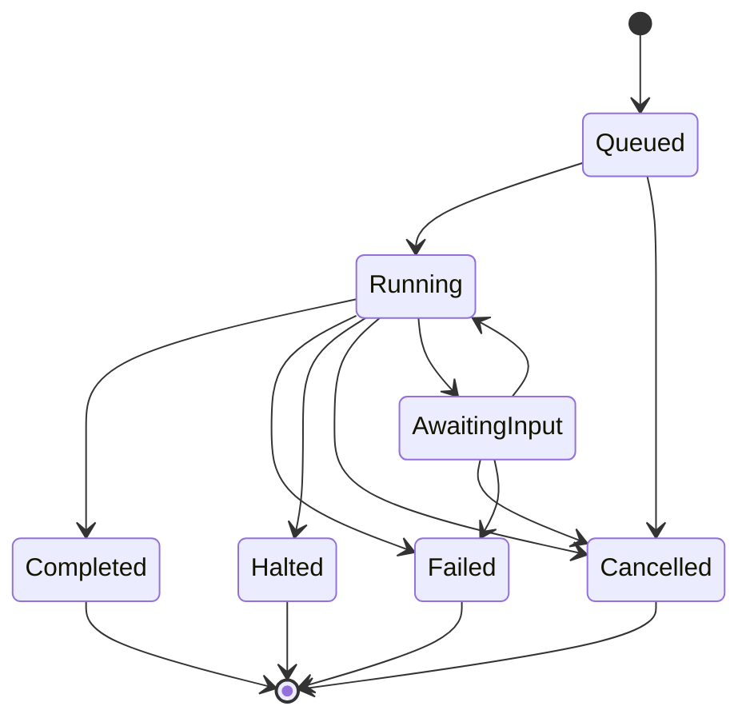

# Platform API — Runs, Threads, Assistants, Schedules, Webhooks

**Since:** v0.10.0 (PRD 06, Phase 27)
**Crates:** `paladin-web` (routes/DTOs), `paladin-ports` (port contracts), `paladin-core` (`Run`,
`RunSchedule`, `WebhookDelivery`), facade `src/application/services/run/*` (the durable worker
pool, streaming bus, schedule service, webhook delivery service)

`paladin-web` was, before this phase, a synchronous execute surface: `POST /agents/{id}/execute`
held the HTTP connection for the whole run. The Platform API turns it into a durable **run
server**: `POST /runs` enqueues and returns immediately, a worker pool drives the engine off the
request path, threads are inspectable and resumable over HTTP, assistants are named/versioned
configurations, schedules trigger runs on cron expressions, and webhooks notify on terminal
states.

Every subsystem below is disabled by default (X-09) — see [Configuration](#configuration) — so a
v0.9 deployment that never sets any of these env vars boots v0.10 identically to before, and every
route answers `501 not_implemented` (naming the config key to set) until an operator wires a
backend.

## Runs

### The status machine

A `Run`'s `status` is one of seven values, transitioned only through a pure, exhaustively-tested
state machine (`RunStatus::try_transition`). Every write is a compare-and-set (`UPDATE ... WHERE
status = ?from`), never a read-modify-write, so the invariant below holds under concurrent
workers with no application-level lock:


```mermaid
stateDiagram-v2
    [*] --> Queued
    Queued --> Running
    Queued --> Cancelled
    Running --> Completed
    Running --> Failed
    Running --> Halted
    Running --> Cancelled
    Running --> AwaitingInput
    AwaitingInput --> Running
    AwaitingInput --> Cancelled
    AwaitingInput --> Failed
    Completed --> [*]
    Failed --> [*]
    Halted --> [*]
    Cancelled --> [*]
```

`Completed`, `Failed`, `Halted` and `Cancelled` are **absorbing terminals** — no edge ever leaves
one. An attempted illegal transition never silently no-ops; it returns a structured
`IllegalTransition { from, to }` error, surfaced as `409 conflict` over HTTP where applicable.

### Submitting a run

```
POST /v1/runs
{
  "assistant_id": "researcher",
  "version": null,            // omit to resolve `latest` at submit time (frozen on the run, D-30)
  "thread_id": null,          // omit to start a fresh thread
  "input": {},                // caller-supplied initial state; defaults to {}
  "webhook": {                // optional; validated by the SSRF guard before anything is persisted
    "url": "https://example.com/hooks/paladin",
    "secret": "whsec_...",
    "events": ["completed", "failed", "awaiting_input"]
  }
}
```

Returns `202 Accepted` with `{ run_id, thread_id, state_url }` — the handler performs exactly one
repository insert and one queue enqueue, with no engine work on the request path (PLAT-FR-01's
p99 ≤ 250ms budget is an architectural property of that fact, not a number to tune).

`GET /v1/runs/{run_id}` returns the full `Run`: `run_id`, `thread_id`, `assistant_id`, `version`,
`status`, `submitted_at`/`started_at`/`finished_at`, `error` (the engine's error, when `Failed`),
`final_waypoint_id` (the final Waypoint the run reached; `null` until it records one) and
`halt_reason` (why a run halted on spend; `null` otherwise) -- see [Halted runs](#halted-runs).

`GET /v1/runs?thread_id=&assistant_id=&status=&limit=&cursor=` lists runs
`(submitted_at DESC, run_id DESC)`, paginated per [Pagination](#pagination); a run's `webhook`
field, if echoed at all, always redacts `secret` to `"***"`.

**`409 thread_busy`.** Submitting to a thread whose latest run is `Queued`, `Running` **or
`AwaitingInput`** returns `409` — a deliberate tightening beyond the literal `Queued|Running` text
(D-18): a thread suspended awaiting input still has an active run, and admitting a second run onto
it would race a concurrent execution over the same Waypoint chain. The `409` body names
`POST /v1/threads/{thread_id}/resume` as the remedy.

**`429 allowance_exhausted`.** A caller whose API-key or tenant allowance is spent is refused
before anything is persisted -- see [Allowance refusals](#allowance-refusals).

### Cancelling a run

```
POST /v1/runs/{run_id}/cancel
```

Returns `202` and is **idempotent** on a non-terminal run (repeat calls are no-ops); `409
conflict` on an already-terminal run. Cancellation is persisted-flag-first: the durable cancel
flag is written through the repository, then the in-process `CancellationToken` is best-effort
signalled if the run happens to be local — durability first means a cancel is never lost to a
crash between the two steps, and a worker on a **different instance** observes the flag at the
next superstep boundary via a `CancellationProbe`.

The engine's own vocabulary and the run's status vocabulary deliberately differ at this boundary:
the **Waypoint** halted (`RunOutcome::Halted`), while the **run** is recorded `Cancelled`. A plain
graceful-shutdown drain (no cancel requested) also produces a `Halted` Waypoint, but the run stays
`Running` for immediate redelivery rather than moving to `Cancelled` — only an explicit
`POST .../cancel` produces the `Cancelled` run status. The live stream follows the same split: a
caller-cancelled run's `done` says `cancelled` (see [Streaming](#streaming) below), and a
worker drain emits no terminal event at all.

### Halted runs

A run whose spend allowance is exhausted while it is in flight halts at its next superstep
boundary: its `status` is `halted`, its `error` is `null` (a halt is a resume point, not a failure)
and its last checkpoint is kept. `GET /v1/runs/{run_id}` and every row of `GET /v1/runs` say why
and where to resume with two fields, both always present (`null` when they do not apply):

| Field | Type | Meaning |
|---|---|---|
| `final_waypoint_id` | string or `null` | The final Waypoint the run reached. For a halted run it is the Halted Waypoint -- the fork point to resume from. |
| `halt_reason` | object or `null` | Why the run halted. `null` for every run that did not halt on spend. |

`halt_reason` is an object tagged by `reason`. For an exhausted allowance it carries the halted
ceiling's own figures -- the same keys, built by the same function, as the `details` of
[`429 allowance_exhausted`](#allowance-refusals):

```json
{
  "status": "halted",
  "error": null,
  "final_waypoint_id": "01926f3e-...",
  "halt_reason": {
    "reason": "allowance_exhausted",
    "scope": "api_key",
    "kind": "window",
    "balance": "1.0000 USD",
    "ceiling": "1.0000 USD",
    "window_start": "2026-10-06T00:00:00Z",
    "window_end": "2026-10-07T00:00:00Z"
  }
}
```

`balance` and `ceiling` are display strings rendered at the edge from exact integer nano-units;
`window_start`/`window_end` are RFC 3339 and `null` for a lifetime ceiling. When the spend ledger
could not be read at the boundary the run halts fail-closed and `halt_reason` is exactly
`{ "reason": "ledger_unavailable" }`. The object never carries another scope's figures, a tenant
id, or an API key name or value.

The reason is written to the run row before the status flips to `halted`, so a reader never sees
a `halted` run without its `halt_reason`.

### Resuming a halted run

A halted run is terminal: it never returns to `queued` or `running`, and re-enqueueing its run id
is not a way to resume it. Resume is a **new run forked from the Halted Waypoint**, which
re-runs the allowance check at submission:

1. Read the halted run: `GET /v1/runs/{run_id}` answers `status: halted`, the `halt_reason` and
   the `final_waypoint_id`.
2. Fork from that Waypoint: `POST /v1/threads/{thread_id}/fork` with
   `{ "from_waypoint_id": "<final_waypoint_id>" }`, using the run's `thread_id`.
3. While the allowance is still exhausted the fork is refused `429 allowance_exhausted` with a
   `Retry-After` header naming the seconds until the window resets. A lifetime cap carries no
   `Retry-After` (the cap does not reset): raise the cap instead. If the spend ledger cannot be
   read the fork is refused `500` and nothing runs (fail closed); retry once it reads again.
4. Once admitted, the fork answers `202 { run_id, thread_id }` and the new run continues from the
   Halted Waypoint: no superstep the halted run already completed is run again. The new run's
   own `GET /v1/runs/{run_id}` reports its progress and, if the allowance is exhausted again, its
   own `halt_reason`. The original run stays `halted`.

A run halted with `halt_reason: { "reason": "ledger_unavailable" }` resumes the same way once the
ledger reads again. An agent-kind run has no checkpoint, so it has no Halted Waypoint to fork
from: resume it with a fresh `POST /v1/runs`.

### Streaming

```
GET /v1/runs/{run_id}/stream          (text/event-stream)
```

Seven wire event names are frozen for this milestone (D-25); every event also carries `seq`, `at`,
`mode` (`live` or `degraded`) and `dropped`:

| `event:` | `data:` payload |
|---|---|
| `superstep` | `{ superstep }` |
| `node_started` | `{ superstep, node_id }` |
| `node_finished` | `{ superstep, node_id, outcome }` |
| `state_delta` | `{ superstep, fields, bytes }` — changed field **names** and a byte-size count only, **never a value** |
| `parley` | `{ waypoint_id, parleys }` |
| `done` | `{ status, waypoint_id, halt_reason? }` — `status` is `completed`, `halted`, `cancelled` or `awaiting_input`; `halt_reason` is present only for a run that halted on spend (see below) |
| `error` | `{ status, message, waypoint_id }` |

If the run is executing on **this** instance, live progress bridges from a `TraceSink` adapter
feeding a per-run broadcast bus (`superstep`/`node_started`/`node_finished`/`state_delta`), while
`parley`/`done`/`error` are published by the worker directly from the outcome it already matches
on. `done`/`error` are always eventually delivered on this path.

**Degraded mode is a documented, first-class path, not an error case.** If the run is executing on
another instance, or is already terminal, the handler synthesizes events by polling persisted
Waypoints instead. **The degraded path gives no ordering guarantee relative to the live path and
may coalesce multiple supersteps into a single observed jump** — it is a "catch up to current
state" view, not a live progress feed. `done`/`error` are still always eventually delivered on the
degraded path; only their timing and granularity relative to the live path are unspecified.

**`done` and the halt reason.** For a run that halted on spend, `done` carries `status: "halted"`
and a `halt_reason` object -- the same object `GET /v1/runs/{run_id}` returns (see
[Halted runs](#halted-runs)), built by one function. For an exhausted allowance it is
`{ "reason": "allowance_exhausted", "scope", "kind", "balance", "ceiling", "window_start",
"window_end" }`; for a ledger that could not be read it is exactly
`{ "reason": "ledger_unavailable" }` and is still a `done`, never an `error` (`error` is reserved
for a `failed` run). A halt with no spend reason (a caller cancel or a token halt) keeps the
payload without a `halt_reason` key. The live, degraded and replay paths agree on `status` and
`halt_reason` for the same run, so a streaming client never needs a follow-up read to learn why a
run stopped; a replayed stream takes both from the run row once the row is terminal, and
`waypoint_id` follows each path's own rule (`null` on the live and replay paths, the row's final
Waypoint id on the degraded path).

**`done` and a caller cancel.** A run a caller cancelled with `POST /v1/runs/{run_id}/cancel`
streams `done` with `status: "cancelled"` and no `halt_reason` key, equal to the `cancelled` status
`GET /v1/runs/{run_id}` reports -- whether the cancel reached the instance that is running the run
(the in-process route) or only the durable flag through another instance (observed at the next
superstep boundary). It said `halted` before; a client that matched on `halted` to detect a cancel
must now match `cancelled`. Spend halts are unchanged: `status: "halted"` plus the reason.

**A worker drain is not a finish.** When a worker shuts down mid-run, the run row stays `running`
and its queue message is redelivered, so no `done` (and no `error`) is emitted for it: a subscriber
sees the stream end without a terminal event. Reconnect to follow the redelivered run, which
streams on whichever instance picks it up. A halt that carries a spend reason is a genuine finish
and is still emitted during shutdown.

A 15-second heartbeat comment line is emitted on **both** paths to defeat idle-proxy timeouts.

## Threads

| Route | Behavior |
|---|---|
| `GET /v1/threads?limit=&cursor=` | Paginated thread summaries |
| `GET /v1/threads/{thread_id}` | A single thread's summary (404 if unknown) |
| `GET /v1/threads/{thread_id}/history` | Paginated Chronicle history: `?limit=20&cursor=...` (limit ≤ 100), `{ items, next_cursor }` |
| `GET /v1/threads/{thread_id}/state` | The thread's latest status, plus outstanding `parleys`/`responses` when suspended |
| `POST /v1/threads/{thread_id}/resume` | `{ "responses": [{ "parley_id", "value", "responded_by" }] }` → `202 { thread_id, state_url, run_id }` |
| `POST /v1/threads/{thread_id}/fork` | `{ "from_waypoint_id", "edit"? }` → submits a **new** run on the same thread from an earlier Waypoint, with `edit` applied → `202 { run_id, thread_id }`; `409 thread_busy` while a run is active; `429 allowance_exhausted` (with `Retry-After`) while the caller's allowance is exhausted -- see [Resuming a halted run](#resuming-a-halted-run) |
| `DELETE /v1/threads/{thread_id}` | Admin-only; `204`; `409 thread_busy` while a run is active |

A resumed run re-enqueues under the **same `run_id`** (`attempt` incremented, D-23) rather than
spawning a new run — `ResumeAcceptedResponse.run_id` (added this phase, `#[non_exhaustive]`,
D-21) lets a caller poll `GET /v1/runs/{run_id}` directly after a resume instead of only
`GET .../state`. A thread with no run row (a pre-run-server thread) keeps the in-process spawn
fallback behavior unchanged.

> **Never template a secret or credential into a Gate's payload.** `GET /v1/threads/{id}/state`
> returns that payload verbatim to any authenticated caller.

## Assistants

An assistant is a named, versioned configuration: `Assistant { assistant_id, versions: [...],
latest }`. Each `AssistantVersion` wraps an `AssistantDefinition`:

```json
{ "kind": "agent", "body": { "...": "a Paladin config as data" } }
```

or

```json
{ "kind": "workflow", "body": { "...": "a WarGraphDoc, see the dedicated schema page" } }
```

— see [WarGraphDoc — the Workflow Assistant Document Format](wargraph-doc-schema.md) for the
`workflow` body's own shape.

| Route | Behavior |
|---|---|
| `POST /v1/assistants` | Admin; creates version 1; `201`/`400` + violation list/`409` (see below) |
| `GET /v1/assistants?limit=&cursor=` | Paginated; merges synthetic code-registry entries (see below) |
| `GET /v1/assistants/{assistant_id}` | A single assistant's summary |
| `DELETE /v1/assistants/{assistant_id}` | Admin; soft-delete; existing runs referencing it stay readable |
| `POST /v1/assistants/{assistant_id}/versions` | Admin; creates version `latest + 1` |
| `GET /v1/assistants/{assistant_id}/versions?limit=&cursor=` | Paginated changelog |
| `GET /v1/assistants/{assistant_id}/versions/{version}` | A single version |

**Publish-time validation is compile-time validation.** An `agent` body validates structurally
into a real Paladin config; a `workflow` body validates by deserializing to a `WarGraphDoc` and
calling its `compile()` against the server's live registries — a version that exists is a version
that runs. A failure returns `400` with a machine-readable violation list:

```json
{
  "error": {
    "code": "validation_failed",
    "message": "assistant definition failed validation",
    "details": [
      { "path": "/body/nodes/1/kind", "code": "unsupported_node_kind", "message": "kind \"function\" is not supported" }
    ]
  }
}
```

Nothing is persisted on a failed validation.

**Versions are immutable, by construction, not by handler discipline.** There is no `update`
method on the admin port and **no `PUT`/`PATCH` route is ever registered** for a version — the
router cannot express the operation. `POST /runs` without an explicit `version` resolves
`latest` and **freezes** it onto the run inside the same database transaction that inserts the
run row (D-30): a version published concurrently with a submit either lands strictly before (the
new run sees it) or strictly after (the run keeps the old one) — never a torn read.

**Code-registered agents are exposed as read-only synthetic assistants.** With
`assistants.expose_code_registry` at its default (`true`), every code-registered agent from the
existing `AgentRegistry` appears in `GET /assistants` as `{ assistant_id, latest: 1, source:
"code" }`, giving clients one discovery surface for both kinds. Every mutating route on a
code-registered id answers `409 code_registered_immutable` before the admin port is ever called.
**Known limitation:** the synthetic merge currently happens on the **first page only** — a full
cursor-walk across a paginated `GET /assistants` may omit code-registered entries past page one
(tracked in the project's defect ledger; not a security issue, since the entries are always
read-only regardless of whether they are listed).

## Schedules

```
POST /v1/schedules
{
  "assistant_id": "researcher",
  "version": null,                    // omit to resolve latest at each tick
  "cron": "0 */15 * * * *",           // 5- or 6-field (croner); optional leading seconds field
  "timezone": null,                   // an IANA name, or omit for UTC
  "input": {},
  "enabled": true,
  "thread_strategy": "new_thread_per_tick",   // or { "fixed_thread": "<thread_id>" }
  "on_missed": "skip",                        // or "run_once"
  "webhook": null
}
```

| Route | Behavior |
|---|---|
| `POST /v1/schedules` | Admin; `201`/`400` + violations/`403`/`501` |
| `GET /v1/schedules?limit=&cursor=` | Paginated |
| `GET /v1/schedules/{schedule_id}` | Includes `last_tick`/`next_tick`/`skipped_ticks` |
| `PATCH /v1/schedules/{schedule_id}` | Admin; every field optional, only present fields change |
| `DELETE /v1/schedules/{schedule_id}` | Admin |

**Cron semantics.** Standard 5-field cron, with an optional leading seconds field for 6-field
expressions; both forms compute identical next-occurrence instants. `timezone` defaults to UTC,
or names an IANA zone. `thread_strategy` controls whether each tick starts a fresh thread
(`new_thread_per_tick`, the default) or always targets the same thread (`fixed_thread`) — a
`fixed_thread` tick landing on a busy thread is **skipped**, and `skipped_ticks` on the schedule
row is incremented, so "why did nothing run" is answerable from `GET .../{id}` without a log dive.

**Restart- and replica-safety, without leader election.** A tick is *claimed* by a single
conditional `UPDATE ... WHERE schedule_id = ? AND next_tick = ?` — exactly one caller's update
affects the row, whether that caller is a second thread after a restart or a second replica
racing the same tick. `next_tick` is persisted, so a restart neither double-fires (the claim
already advanced it) nor fires-then-double-fires later. `on_missed` governs what happens when a
tick is discovered well past due: `skip` (default) recomputes `next_tick` from now without
submitting; `run_once` submits exactly once, then recomputes.

`ScheduleResponse.webhook.secret` always renders `"***"` (or `null` if unset) — the raw secret is
accepted on write but never echoed back.

**Creator attribution and allowances.** `POST /v1/schedules` records the creating principal's
tenant id and API key name on the schedule. A run the schedule fires is attributed to that
creator, so its spend settles under the creator's tenant and key, and each tick is admitted
against the creator's allowance like a `POST /v1/runs` by that key. A tick whose creator's
tenant or API-key allowance is exhausted fires **no run**: it is skipped, `skipped_ticks` on the
schedule is incremented, and nothing is written to the run store or the queue. If the creator's
key was later removed from the configuration, the schedule stays attributed by the recorded names
and is gated by the tenant allowance only. The creator is deliberately **not** returned in the
schedule responses, because `GET /v1/schedules` is not tenant-scoped. `PATCH` never changes it.

**Known gap: schedules created before this release.** A schedule created before creator
attribution existed has no recorded creator. It keeps firing exactly as before, unattributed and
not gated by any allowance. To bring it under allowances, re-create it through
`POST /v1/schedules` (a backfill and a `PATCH` re-assignment are not implemented).

**The role check is not applied at fire time.** A schedule-fired run carries the creator's
identity (tenant id and key name) but never a role, so it skips the assistant's `allowed_roles`
check exactly as it did before. A schedule created by an Admin on an assistant whose
`allowed_roles` excludes Admin therefore still fires.

## Webhooks

A run's or schedule's `webhook` spec `{ url, secret?, events }` subscribes to lifecycle events
(`awaiting_input`, `completed`, `failed`, `halted`, `cancelled`). Delivery is a **persisted
queue**, drained by a service — never a spawned task that would lose deliveries on restart —
proven under a race so each due delivery is claimed exactly once.

**Payload** (exactly this key set; no run input, no Battlefield state, no signing secret ever
appears):

```json
{
  "run_id": "...",
  "thread_id": "...",
  "assistant": { "assistant_id": "researcher", "version": 3 },
  "status": "completed",
  "event": "completed",
  "timestamp": "2026-09-08T12:00:00Z",
  "attempt": 1,
  "parleys": null
}
```

A `halted` event whose run halted on spend additionally carries an optional `halt_reason` key,
equal to the [`halt_reason` object on the run](#halted-runs); no other event carries it, and the
payloads of every other event are unchanged:

```json
{
  "run_id": "...",
  "thread_id": "...",
  "assistant": { "assistant_id": "researcher", "version": 3 },
  "status": "halted",
  "event": "halted",
  "timestamp": "2026-10-06T12:00:00Z",
  "attempt": 1,
  "halt_reason": { "reason": "ledger_unavailable" }
}
```

**Signature verification.** If `secret` is set, every delivery carries:

```
X-Paladin-Signature: sha256=<hex>
```

computed as HMAC-SHA256 over the **exact byte buffer that is sent** — never re-serialized between
signing and sending, so a receiver's own recomputation over the raw bytes it captured always
matches:

```text
signature = hex(hmac_sha256(key = secret, message = raw_request_body_bytes))
# Verify (pseudo-code, over the RAW bytes you received — never over a re-parsed/re-serialized copy):
expected = hex(hmac_sha256(key = your_stored_secret, message = raw_body_bytes))
assert constant_time_eq(expected, header_value_after_"sha256=")
```

**Retry schedule.** `2xx` is delivered. Any `3xx` (redirects are never followed — see below) or
`4xx` **dead-letters immediately** — the target itself is rejecting the payload, and a retry is
usually not the fix. A `5xx` response, a timeout, or a connect error retries with exponential
backoff — `1s, 2s, 4s, 8s, 16s` between successive attempts, capped at 60s — up to
`webhooks.max_attempts` (default `5`) total attempts, after which the delivery is dead-lettered. A
dead-lettered delivery stays queryable with its final status and response code.

```
GET /v1/runs/{run_id}/webhook-deliveries?limit=&cursor=
```

lists persisted delivery attempts newest-first: `attempt`, `status`, `next_attempt_at`,
`last_response_status`, `last_error` — the payload's signing secret is never included in the
response.

**The SSRF guard** is a standalone, table-tested function applied at **both** write time (when a
webhook URL is first accepted, e.g. `POST /runs`, `POST /schedules`) and send time (immediately
before every delivery attempt, since a hostname's resolution can change between the two). It
rejects:

- any scheme other than `http`/`https`;
- any host resolving to a **loopback** address;
- any host resolving to a **link-local** address (`169.254.0.0/16`, `fe80::/10`) — which covers
  the cloud metadata address `169.254.169.254`, **always rejected regardless of
  `allow_private`**;
- any host resolving to an **RFC1918** private address;
- any host resolving to a **unique-local** (`fc00::/7`) address;
- any host resolving to an **unspecified** address (`0.0.0.0`, `::`).

`webhooks.allow_private` (default `false`) is the **only** override, and it never overrides the
metadata-address rejection. The webhook HTTP client **never follows redirects** — a followed
redirect would both forward the `X-Paladin-Signature` credential header to an attacker-chosen host
and bypass the write-time check entirely, which is also why a `3xx` response dead-letters instead
of retrying.

**Known limitation, documented rather than implemented: DNS rebinding.** Neither the write-time
nor the send-time check *pins* the resolved address between the classification check and the
actual TCP connection the HTTP client makes. A hostname that answers a public address at check
time and a private/metadata address at connect time (classic DNS rebinding) is not defended
against by this guard alone — resolve-then-connect address pinning is not implemented in this
milestone. Naming this gap plainly is the point: PRD 06's own functional requirement explicitly
permits documenting it rather than closing it, and claiming coverage that does not exist would be
worse than the gap itself.

### Operator allowance notices

When the operator configures `treasurer.allowance.webhook` (see the
[configuration guide](../getting-started/configuration.md#treasurer-allowances)), the Treasurer
posts one **operator notice** the first time a balance reaches `warn_at` percent of an allowance
ceiling, before callers start receiving `429 allowance_exhausted`. It rides the same durable queue
as the run webhooks above -- the same no-redirect client, SSRF guard (at boot and at send time),
retry schedule and dead-lettering -- but it is the **operator's**, not the caller's: it never
appears in `GET /v1/runs/{run_id}/webhook-deliveries` for the admitting run, and a caller cannot
subscribe a run or schedule `webhook.events` to `allowance_warning` (that answers `400`).

**Payload** (exactly these twelve keys; no run input, no API key value and no signing secret ever
appears):

```json
{
  "event": "allowance_warning",
  "scope": "api_key",
  "kind": "window",
  "balance": "0.8000 USD",
  "ceiling": "1.0000 USD",
  "window_start": "2026-10-03T00:00:00Z",
  "window_end": "2026-10-04T00:00:00Z",
  "warn_at": 80,
  "run_id": "...",
  "timestamp": "2026-10-03T09:15:00Z",
  "tenant_id": "acme",
  "api_key_id": "ci-runner"
}
```

`scope` is `api_key` or `tenant`; `kind` is `window` or `lifetime`; `balance` and `ceiling` are
display strings; `window_start` and `window_end` are RFC 3339 and `null` for a lifetime ceiling.
`run_id` is the run whose admission won the notice, or `null` on the HTTP agent routes (no run row
exists there). `api_key_id` is the API key's configured **name**, never its value, and is `null`
for a tenant-scope notice. `timestamp` is the ledger store's clock when the notice was recorded.

**Headers and signature.** The request carries `X-Paladin-Event: allowance_warning` and
`X-Paladin-Delivery: <delivery id>`. If a `secret` is configured it is signed exactly like a run
webhook -- `X-Paladin-Signature: sha256=<hex>`, HMAC-SHA256 over the raw request body bytes -- with
`treasurer.allowance.webhook.secret` (or `APP_TREASURER_ALLOWANCE_WEBHOOK_SECRET`). Verify it over
the raw bytes you received, as above. Without a secret the body is signed with the empty key.

**Delivery semantics.** At most one notice is recorded per scope, limit kind, window and ceiling
(raising a ceiling re-arms it), so at most one delivery is enqueued for each; the delivery itself is
at-least-once. Omitting `treasurer.allowance.webhook` disables only this leg -- the durable notice
row, the trace event and the herald allowance line still occur. If the operator notice cannot be
enqueued the failure is logged and not retried, and the run is unaffected. A private or loopback
target needs `webhooks.allow_private: true`; the cloud metadata address is always rejected, and
`paladin-server` refuses to start on a rejected target.

On the HTTP agent routes (`/v1/agents/{id}/execute`, `/execute/stream`, `/jobs`) the durable notice
row and this operator webhook always fire. The `allowance_warning` trace event is emitted there only
when an agent-path trace emitter is wired, and the herald allowance line appears only on the
streamed final chunk (`/execute/stream`).

## Pagination

Every list endpoint (`/runs`, `/threads`, `/assistants`, `/assistants/{id}/versions`,
`/schedules`, `/runs/{id}/webhook-deliveries`) shares one shape:

```
?limit=20&cursor=<opaque>
```

- `limit` defaults to `20`; the valid range is `1..=100`. An out-of-range `limit` (`0` or `> 100`)
  returns `400 bad_request` — it is never silently clamped.
- `cursor` is an **opaque** token (encoding the last-seen row's key) — never parse or construct
  one client-side. A malformed, truncated or tampered cursor returns `400 bad_request` with a
  stable code, never a 500 and never a full-table scan.
- The response shape is always `{ items: [...], next_cursor }`; `next_cursor` is `null` when the
  page ends on the last row. An empty result set is `200 { items: [], next_cursor: null }` — never
  `404`, never a bare array.
- **Cursor pagination here gives a stable walk over rows that already existed when the first page
  was fetched, but it is not a snapshot:** rows inserted after the first page was fetched may be
  omitted from a subsequent page of the same walk. Treat a paginated list as "the state as of when
  you started paging," not a point-in-time snapshot.

## Authentication and scopes

Every new route sits behind the same authentication middleware and the same rate limiting
`/v1/agents/*` already uses. Mutating routes follow a two-tier convention (D-46), matching
`agent_controller`'s existing pattern rather than inventing a third:

| Shape | Routes | Gate |
|---|---|---|
| **Invocation-shaped** | run submit/cancel/resume/fork | `authorize_invoke` against the target assistant's `allowed_roles` — any authenticated principal the assistant itself permits |
| **Registry-shaped** | assistant create/publish-version/delete; schedule create/patch/delete; thread delete | `require_admin` — an admin-role credential |
| **Reads** | every `GET` | authentication plus the tenant read scope below -- a principal reads only runs its tenant submitted, unless it is an admin |

**Which runs a caller can see (PLAT-07, Phase 40).** Every run records the principal that
submitted it -- the tenant and the API key's configured name -- and the read routes serve only
the runs the calling principal may see:

- A **user-role** key sees only runs recorded under **its own tenant**. Two keys mapped to the
  same tenant see each other's runs; a key of another tenant does not. A user-role key never
  sees a run with no recorded principal.
- An **admin-role** key (the deployment-operator role, the same one that gates the registry
  routes) sees **every run**, including runs with no recorded principal -- schedule-fired runs,
  runs submitted from the same process, and runs submitted before v0.11. When authentication is
  disabled, the open-access principal is admin-role, so an open deployment keeps reading every
  run.

The tenant comes **only** from the key's configured mapping (`http.auth.api_keys[].tenant`, or
`http.auth.bearer_token.tenant` for bearer principals). No header, query parameter or body
field can name a tenant; a `tenant_id` query parameter on `GET /runs` is unknown and ignored.

The scope applies the same way everywhere. `GET /runs` lists only visible runs -- the
`thread_id`/`assistant_id`/`status` filters compose with the scope, so another tenant's
`thread_id` yields an empty page, and the cursor walk stays gap-free because the filter runs
inside the store's own query. `GET /runs/{run_id}`, `GET /runs/{run_id}/stream`,
`GET /runs/{run_id}/webhook-deliveries` and `POST /runs/{run_id}/cancel` all answer the
**same `404` as a run that does not exist** for a run the caller may not see -- never a `403`,
never a different message -- so a foreign tenant cannot learn that a run exists or read its
webhook target URL, and cancel is refused before any role check so it can never mutate another
tenant's run. `RunResponse.submitted_by` shows the recording tenant and API key name
(`{ "tenant_id", "api_key_id" }`, or `null` when no principal was recorded); it never carries the
key value or the role. A client that used to read other principals' runs must use an
admin-role key.

`/v1/threads/*` reads are **not yet tenant-scoped**: threads carry no tenant, so
`GET /threads`, `GET /threads/{id}/state` and `GET /threads/{id}/history` remain
deployment-wide for any authenticated principal. That gap is tracked in the project's
broken-windows ledger, not implied closed by the run scope above.

### Allowance refusals

When the operator configures a spend allowance (`treasurer.allowance`, see the
[configuration guide](../getting-started/configuration.md)), a caller whose API key or tenant has
reached a ceiling is refused with `429 allowance_exhausted` -- before any run, job or queue entry
is created. Five routes answer it, because each starts LLM spend under the calling principal:

| Route | Refusal behaviour |
|---|---|
| `POST /v1/runs` | refused before the run row is written |
| `POST /v1/threads/{id}/fork` | refused before the fork's run row is written |
| `POST /v1/agents/{id}/execute` | refused before the agent is invoked |
| `POST /v1/agents/{id}/execute/stream` | a plain JSON `429` returned before any event stream opens |
| `POST /v1/agents/{id}/jobs` | refused synchronously: no job id is issued and nothing is spawned |

If the allowance check itself cannot be completed (for example the spend ledger is unreachable),
the same routes answer `500` and run nothing -- the check fails closed. A request with no
principal, or a principal with no configured allowance, is never gated.

The body is the standard error envelope with the dedicated code `allowance_exhausted`; its
`details` carry exactly the refused ceiling's own figures and never the caller's tenant or key:

```json
{
  "error": {
    "code": "allowance_exhausted",
    "message": "...",
    "details": {
      "scope": "api_key",
      "kind": "window",
      "balance": "2.5000 USD",
      "ceiling": "2.5000 USD",
      "window_start": "2026-10-03T00:00:00Z",
      "window_end": "2026-10-04T00:00:00Z"
    }
  }
}
```

`scope` is `api_key` or `tenant`; `kind` is `window` or `lifetime`; `balance` and `ceiling` are
display strings; `window_start`/`window_end` are RFC 3339 and `null` for a lifetime ceiling.

A `Retry-After` header carries the whole seconds from the **ledger store's clock** (not the web
server's) to the window's end. It is omitted for a lifetime ceiling, which never reopens.

An `admin`-role key is bound by its allowance exactly like any other key: the role is not part of
the check. The per-IP rate limiter also answers `429`, but with the different code
`too_many_requests`, so a client can tell quota from pacing by the body code alone.

## Configuration

Every subsystem below is its own config struct (`Default` + `validate()` + `EnvOverridable`),
loaded via `APP_`-prefixed environment variables, and **defaults to disabled/safe** so a v0.9
deployment boots v0.10 unchanged (X-09) — the sole deliberate exception is
`assistants.expose_code_registry`, which defaults **on** (see below).

| Struct | Env vars | Defaults |
|---|---|---|
| `run_store` | `APP_RUN_STORE_BACKEND` (`disabled`\|`sqlite`\|`postgres`), `APP_RUN_STORE_PATH`, `APP_RUN_STORE_URL_ENV` | `disabled` — every run route answers `501` until set |
| `run_queue` | `APP_RUN_QUEUE_BACKEND` (`in_memory`\|`redis`), `APP_RUN_QUEUE_URL_ENV`, `APP_RUN_QUEUE_KEY_PREFIX` | `in_memory` |
| `run_worker` | `APP_RUN_WORKER_CONCURRENCY`, `APP_RUN_WORKER_LEASE_SECONDS`, `APP_RUN_WORKER_MIN_PROBE_INTERVAL_MS` | `concurrency=4`, `lease_seconds=60` (heartbeat = `lease/4`, no separate knob), `min_probe_interval_ms=1000` |
| `run_stream` | `APP_RUN_STREAM_POLL_INTERVAL_MS` | `poll_interval_ms=1000` (degraded-path polling only) |
| `assistants` | `APP_ASSISTANTS_EXPOSE_CODE_REGISTRY` | `expose_code_registry=true` — the one deliberate exception to "off by default": the exposed data is read-only and was already discoverable via the pre-existing `AgentRegistry`, so this only unifies the read surface |
| `schedules` | `APP_SCHEDULES_ENABLED`, `APP_SCHEDULES_TICK_INTERVAL_MS` | `enabled=false`, `tick_interval_ms=1000` |
| `webhooks` | `APP_WEBHOOKS_ALLOW_PRIVATE`, `APP_WEBHOOKS_MAX_ATTEMPTS`, `APP_WEBHOOKS_TIMEOUT_SECS` | `allow_private=false`, `max_attempts=5`, `timeout_secs=10` |

`run_store`'s `postgres` variant, and `run_queue`'s `redis` variant, each carry the **name** of an
environment variable holding the connection URL — never the URL itself — so a connection string
(which may embed a password) never lands in a serialized config payload or a `Debug`/log line.

## Deployment

Running the worker pool and the scheduler as separate, horizontally-scaled replicas behind the
same run store and queue is a deployment topology, not a code change — see
[Queue / Worker (Distributed)](../deployment-topologies/queue-worker.md) for a worked
producer/worker-replica example and its own statement of the in-process auth token store's
single-replica scope (ADR-0041).
