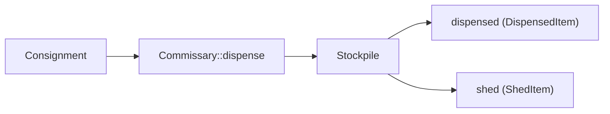

# Commissary

The `Commissary` is the input-side, per-call window-rationing officer — "what fits in this
sortie's pack". It ships in `paladin-llm` (`crates/paladin-llm/src/services/commissary.rs`) and
is re-exported unconditionally from the facade, so it is available at the top-level `paladin::`
path alongside the framework's other domain services. The design record, the
Quartermaster→Commissary rename rationale, and the rejected-name list are in ADR-0049
(`.planning/decisions/0049-commissary-design-and-rename.md`).

## Concept

`Commissary` keeps two responsibilities deliberately separate:

- **`Commissary::verify_fits`** — a pre-flight GUARD. It measures an already-assembled prompt
  against the provider's declared context window (minus the caller's reserved completion budget)
  and returns an error naming the measured tokens, the allowance, and the provider when it would
  overflow. It never trims.
- **`Commissary::dispense`** — a bounded ALLOCATOR. Given fixed (non-sheddable) material and a
  `Consignment` of caller-prioritised, shed-or-truncate-able material, it returns a `Stockpile`:
  every retained item clamped to a per-item share (with a visible truncation marker when a cut
  was needed) and every item that did not survive recorded, never dropped silently.

**Framework owns measurement and enforcement; callers own policy.** `Commissary` never decides
WHICH material matters more — that is the caller-supplied `priority` on each `ConsignmentItem`.
No audit-specific or other application-specific policy crosses into `paladin-llm`. Fail-loud,
never-silent: a `Commissary` never guesses a context window, never clamps a caller's material
without recording it, and never presents an estimate as if it were an exact tally.

## The model

| Type | Purpose |
|---|---|
| `Consignment` | An ordered collection of `ConsignmentItem` entries awaiting dispensing. Carries no shedding or truncation policy of its own. |
| `ConsignmentItem` | A single labelled piece of material: `label`, `body`, and `priority` (lower number == higher priority == shed last). |
| `DispensedItem` | A `ConsignmentItem` that survived dispensing: `label`, `body`, `truncated`, `allotted_bytes`. |
| `ShedItem` | A `ConsignmentItem` that did not survive dispensing, recorded so nothing is dropped silently: `label`, `priority`, `original_bytes`. |
| `Stockpile` | The result of `Commissary::dispense`: `dispensed` (retained items), `shed` (dropped items), `prompt_tokens`, `allotted_tokens`, `exact_tally`. |
| `CommissaryPlan` | Configuration governing how a `Commissary` resolves its allowance and dispenses material — reserved completion tokens, fallback context tokens, per-item byte bounds, the truncation marker, and the model hint. |
| `CommissaryError` | Five variants, each naming its own numbers: `UndeclaredContextWindow`, `ReservationExceedsWindow`, `FixedMaterialExceedsAllowance`, `ContextOverflow`, `InvalidConfig`. |

This page names exactly this surface — no more. `Commissary` ships no constructor, builder or
convenience method beyond `Commissary::new`, `Commissary::from_port`, `Commissary::verify_fits`,
`Commissary::dispense` and `Commissary::allotted_tokens`.

## Flow



## Usage sketch

Both blocks below are fenced `rust,ignore` rather than live doc tests: `MockCounter` and
`capabilities_with_window` are test-only helpers in `commissary.rs`'s own `#[cfg(test)] mod
tests`, so a live doctest would require inventing a public substitute — which this page does not
do.

Constructing a `Commissary` and dispensing a consignment, mirroring
`crates/paladin-llm/src/services/commissary.rs:644-698` (the `commissary()` test helper and
`an_over_budget_consignment_sheds_the_lowest_priority_item_first`):

```rust,ignore
use std::sync::Arc;
use paladin_llm::services::commissary::{Commissary, CommissaryPlan, Consignment, ConsignmentItem};
use paladin_ports::output::llm_port::ProviderCapabilities;

let capabilities = ProviderCapabilities {
    max_context_tokens: Some(100),
    ..Default::default()
};
let commissary = Commissary::new(
    "deepseek",
    capabilities,
    /* counter: Arc<dyn TokenCounterPort> */ counter,
    CommissaryPlan::default(),
)?;

let mut consignment = Consignment::new();
consignment.push(ConsignmentItem {
    label: "high-priority".into(),
    body: "A".repeat(300),
    priority: 1, // lower number == higher priority == shed last
});
consignment.push(ConsignmentItem {
    label: "low-priority".into(),
    body: "B".repeat(300),
    priority: 2, // higher number == lower priority == shed first
});

let stockpile = commissary.dispense("", &consignment)?;
// stockpile.shed[0].label == "low-priority"        (lower priority shed first)
// stockpile.dispensed[0].label == "high-priority"  (higher priority retained)
```

The `verify_fits` pre-flight guard, mirroring `commissary.rs:911-929`
(`verify_fits_reports_measured_and_allowed_on_overflow`) and the `CommissaryError` variants at
`commissary.rs:230-292`:

```rust,ignore
match commissary.verify_fits(&assembled_prompt) {
    Ok(measured_tokens) => {
        // proceed to call the provider — measured_tokens fits the allowance
    }
    Err(CommissaryError::ContextOverflow { measured_tokens, allotted_tokens, provider }) => {
        // fail loud — never silently truncate; measured_tokens > allotted_tokens
    }
    Err(other) => {
        // UndeclaredContextWindow, ReservationExceedsWindow,
        // FixedMaterialExceedsAllowance, or InvalidConfig
    }
}
```

## Honesty about exactness

Not every model has an exact tokenizer available offline. Exactness is declared by the injected
`TokenCounterPort` itself, through its `is_exact` method — `TiktokenCounter` reports exact,
`HeuristicTokenCounter` inherits the port's `false` default — and that answer surfaces unchanged
as `Stockpile.exact_tally`, so a reader of a `Commissary`-produced stockpile can always tell an
exact tally from a deliberately over-counting estimate and budget its own margin accordingly.

## See also

- [Domain Model](domain-model.md) — the Medieval Military naming convention and the
  plain-vs-Medieval vocabulary rule `Commissary` follows.
- [Configuration](../getting-started/configuration.md) — the `max_tokens` terminology table,
  which distinguishes `Commissary`'s per-call rationing from the other `max_tokens` senses in the
  framework.
