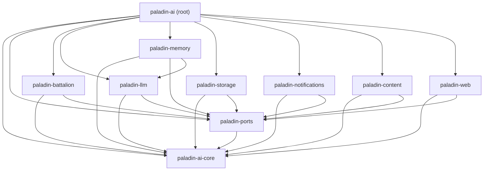

# Crate Map

This page documents all nine workspace crates, their roles, feature flags, and
dependency relationships.

## Workspace Overview

```
paladin-ai  (root umbrella, v0.5.0)
├── paladin-ai-core          # Core domain
├── paladin-ports            # Port trait contracts
├── paladin-battalion        # Orchestration services
├── paladin-llm              # LLM adapters
├── paladin-memory           # Memory adapters
├── paladin-storage          # SQL adapters
├── paladin-notifications    # Notification adapters
├── paladin-content          # Content adapters
└── paladin-web              # HTTP server
```

## Dependency Graph



## Crate Details

### `paladin-ai-core`

**Directory:** `crates/paladin-core/`
**Layer:** Core domain
**External deps:** serde, uuid, chrono, tokio (runtime only), thiserror

Pure domain types — zero infrastructure dependencies.

**Key modules:**
```
src/
├── base/
│   ├── node.rs          # Node<T> entity wrapper
│   ├── collection.rs    # Paginated collections
│   ├── field.rs         # Dynamic field definitions
│   └── message.rs       # Inter-agent messages
└── platform/container/
    ├── paladin.rs             # Paladin aggregate
    ├── paladin_config.rs
    ├── paladin_error.rs
    ├── garrison.rs            # Garrison domain types
    ├── garrison_error.rs
    ├── arsenal/               # Arsenal + ToolDefinition
    ├── citadel.rs
    ├── herald.rs
    ├── sanctum.rs
    └── battalion/             # Battalion domain types
```

---

### `paladin-ports`

**Directory:** `crates/paladin-ports/`
**Layer:** Application boundary
**External deps:** `paladin-ai-core`, async-trait, tokio

Port trait contracts. No infrastructure SDKs.

**Key modules:**
```
src/output/
├── llm_port.rs              # LlmPort
├── garrison_port.rs         # GarrisonPort
├── sanctum_port.rs          # SanctumPort
├── arsenal_port.rs          # ArsenalPort
├── citadel_port.rs          # CitadelPort
├── file_storage_port.rs     # FileStoragePort
├── notification_port.rs     # NotificationPort
├── queue_port.rs            # QueuePort
├── embedding_port.rs        # EmbeddingPort
└── …
```

---

### `paladin-battalion`

**Directory:** `crates/paladin-battalion/`
**Layer:** Application services
**External deps:** `paladin-ai-core`, `paladin-ports`, tokio, serde

All eight orchestration patterns + Commander router.

**Key modules:**
```
src/
├── formation_service.rs          # Sequential N→N+1
├── phalanx_service.rs            # Concurrent parallel
├── campaign_service.rs           # DAG / graph
├── chain_of_command_service.rs   # Hierarchical delegation
├── conclave_execution_service.rs # Expert synthesis
├── council_service.rs            # Multi-agent discussion
├── grove_service.rs              # Semantic routing
├── maneuver/                     # Flow DSL
└── commander.rs                  # Strategy auto-router
```

---

### `paladin-llm`

**Directory:** `crates/paladin-llm/`
**Layer:** Infrastructure (LLM adapters)
**External deps:** `paladin-ai-core`, `paladin-ports`, reqwest, serde_json, tokio

**Feature flags:**

| Flag | Default | Enables |
|------|---------|---------|
| `openai` | yes | `OpenAIAdapter`, `OpenAIEmbeddingAdapter` |
| `anthropic` | no | `AnthropicAdapter` |
| `deepseek` | no | `DeepSeekAdapter` |
| `mock` | yes | `MockLlmAdapter`, `MultiStepMockLlmPort` |
| `openai-embeddings` | no | Embedding API |
| `vision` | no | Vision / multimodal extensions |

**Key modules:** `src/openai/`, `src/anthropic/`, `src/deepseek/`, `src/mock.rs`

---

### `paladin-memory`

**Directory:** `crates/paladin-memory/`
**Layer:** Infrastructure (memory adapters)
**External deps:** `paladin-ai-core`, `paladin-ports`, `paladin-llm` (unconditional,
`default-features = false`), optionally sqlx, qdrant-client, tiktoken-rs

`paladin-memory` depends on `paladin-llm` so `RagRetrievalService` can ration its RAG
injection budget through `Commissary::dispense` — this is the workspace's first
unconditional production lateral adapter dependency (Phase 33, COMM-01).

**Feature flags:**

| Flag | Default | Enables |
|------|---------|---------|
| `sqlite` | no | `SqliteGarrison` |
| `qdrant` | no | `QdrantSanctumAdapter` |
| `content-processing` | no | `TiktokenCounter` |

**Key modules:**
```
src/
├── garrison/
│   ├── in_memory.rs     # InMemoryGarrison (always)
│   └── sqlite.rs        # SqliteGarrison (feature: sqlite)
├── sanctum/
│   ├── in_memory.rs     # InMemorySanctum (always)
│   └── qdrant.rs        # QdrantSanctumAdapter (feature: qdrant)
└── services/
    ├── memory_extraction_service.rs
    └── rag_retrieval_service.rs
```

---

### `paladin-storage`

**Directory:** `crates/paladin-storage/`
**Layer:** Infrastructure (SQL repositories)
**External deps:** `paladin-ai-core`, `paladin-ports`, optionally sqlx, mysql

**Feature flags:** `sqlite`, `mysql`

---

### `paladin-notifications`

**Directory:** `crates/paladin-notifications/`
**Layer:** Infrastructure (notification adapters)
**Feature flags:** `email` (lettre + handlebars), `push` (stub), `system`

---

### `paladin-content`

**Directory:** `crates/paladin-content/`
**Layer:** Infrastructure (content processing)

Provides HTTP/file content fetcher, RSS/news ingestion, document parsing, and
LLM-powered content analysis pipelines.

---

### `paladin-web`

**Directory:** `crates/paladin-web/`
**Layer:** Infrastructure (HTTP server)
**External deps:** actix-web, axum, tokio, serde

User management REST API, RBAC middleware, content delivery endpoints.

---

### `paladin-ai` (root umbrella)

**Directory:** `/` (workspace root)
**Feature flags:**

| Flag | Default | Enables |
|------|---------|---------|
| `llm-openai` | yes | OpenAI adapter |
| `redis-queue` | no | Redis task queue |
| `s3-storage` | no | MinIO / S3 storage |
| `openai-embeddings` | no | Embedding API |
| `qdrant` | no | Qdrant vector DB |

## Adding a New Crate

1. Create `crates/my-new-crate/` with `Cargo.toml` + `src/lib.rs`
2. Add to `[workspace.members]` in the root `Cargo.toml`
3. Set the layer: depend only on crates at the same or inner layers
4. Add to the root `paladin-ai` umbrella via an optional dependency
5. Document in this crate map

## See Also

- [Crate Map & Feature Flags (API Reference)](../api-reference/crate-map.md) — consumer/dependency view with copy-paste `Cargo.toml` profiles.
- [Architecture Overview](overview.md)
- [Hexagonal Design](hexagonal-design.md)
- [Domain Model](domain-model.md)
