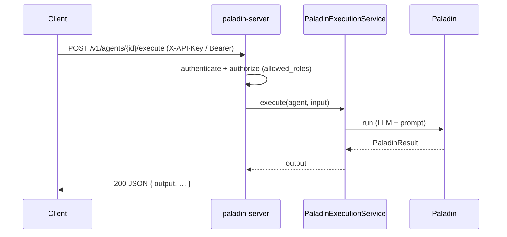

# HTTP Service Host

Run one long-lived process that keeps several distinct agents **resident behind an HTTP
API**, so external clients can invoke them and many requests run concurrently. This is the
closest topology to "a running instance you hit."

> **Paladin ships this out of the box.** The `paladin-server` binary (the `web-server`
> feature) serves a complete agent API — execution, streaming, async jobs, discovery,
> runtime registration, health/readiness, authentication, and an OpenAPI-documented `/v1`
> surface. You configure it; you don't have to compose the endpoint yourself. (You *can*
> still embed the same routes in your own `axum` app — see [Embedding](#embedding-in-your-own-app).)

## When to choose it

- **Choose it when** an external client needs request/response access to your agents, and a
  single in-process call won't do.
- **Look elsewhere when** you only call agents from your own code
  ([embedded library](embedded-library.md)), or you need scale-out / backpressure
  ([queue / worker](queue-worker.md)), or hard per-agent process isolation
  ([sidecar](sidecar.md)).

## The shipped server

The agent API is served under a **`/v1`** version prefix; operational and docs endpoints are
unversioned.

| Method & path | Description |
|---------------|-------------|
| `POST /v1/agents/{id}/execute` | Run an agent, return the full result as JSON |
| `POST /v1/agents/{id}/execute/stream` | Run an agent, stream tokens as SSE (`chunk` … `done`) |
| `POST /v1/agents/{id}/jobs` | Enqueue an async run; returns a `job_id` |
| `GET /v1/agents/{id}/jobs/{job_id}` | Poll a job (`running` → `completed`/`failed`/`timed_out`) |
| `GET /v1/agents` · `GET /v1/agents/{id}` | Discover registered agents |
| `POST /v1/agents` · `DELETE /v1/agents/{id}` | Register / deregister at runtime (**admin**) |
| `GET /health` · `GET /ready` | Liveness / readiness probes (unauthenticated) |
| `GET /openapi.json` · `GET /docs` | OpenAPI 3.1 spec + Swagger UI |

Every error is a structured envelope `{ "error": { "code", "message", "details" } }`; every
response carries an `x-request-id`. Each run is bounded by a timeout (server default,
per-agent, or per-request), and on expiry the work is cancelled (`504`, or a terminal `error`
SSE event).

## Request flow



> **This topology carries no Garrison and no Arsenal.** An HTTP-served agent has no memory
> (Garrison) and no tools/MCP (Arsenal) — `AgentSpec` has no field for either, and this is a
> permanent property of the shipped topology, not a gap awaiting a future release. If your
> agent needs memory or tools, build it on the [embedded library](embedded-library.md)
> topology instead (optionally wrapped in your own HTTP layer, as shown in
> [Embedding](#embedding-in-your-own-app) below).

## Configuring the host

Agents and host settings come from `config.yml` (see
[`config.example.yml`](https://github.com/DF3NDR/paladin-dev-env/blob/main/config.example.yml)).
A minimal shape:

```yaml
server:
  host: "0.0.0.0"
  port: 8080

http:
  auth:
    enabled: true                  # fail-closed: the server refuses to start with no credentials
    api_keys:
      - { key: "${PALADIN_API_KEY_CI}", name: "ci", role: "admin", tenant: "platform-ops" }
  docs:
    enabled: true                  # GET /openapi.json + Swagger UI at /docs

agents:
  - id: "researcher"
    model: "gpt-4"
    system_prompt: "You research topics thoroughly."
    allowed_roles: ["admin", "user"]   # empty ⇒ any authenticated caller
```

### Authentication & authorization

Auth is **enabled by default and fail-closed** — with no credentials configured the server
refuses to start (set `http.auth.enabled: false` for trusted/dev use). Callers present an
**API key** (`X-API-Key`) or an **opaque server-issued bearer token** (`Authorization: Bearer`),
verified against the server's own token store — not a signed or self-describing token; a
key/token maps to a role. Per-agent `allowed_roles` gate invocation, and runtime
register/deregister require an `admin` role. `/health`, `/ready`, `/openapi.json`, and `/docs`
are always reachable without a credential.

**Tenants and what a key can read.** Every API key maps to exactly one tenant through
`http.auth.api_keys[].tenant`. The field is **required**: a key without one, or with a value
that is not a plain identifier (non-empty, no whitespace, printable ASCII, at most 128 bytes),
stops the server at boot with an error naming the key by `name` — there is no implicit default
tenant, and the error never prints a key value. Key `name`s and key values must each be unique
across the list (a duplicated secret would resolve to an arbitrary principal, so it is rejected
at boot too). Bearer-token principals take the tenant configured at `http.auth.bearer_token.tenant`,
which is required whenever `http.auth.bearer_token.enabled` is true. The tenant is derived by
the server from the presented credential and nothing else: no header, query parameter or body
field can assert one. Every submitted run is attributed to the submitting key (`name`) and its
tenant, and read access follows that attribution — `GET /runs` and every `/runs/{run_id}*`
route (`GET`, `/stream`, `/cancel`, `/webhook-deliveries`) show a `user`-role key only its own
tenant's runs, while an `admin`-role key sees every run, including runs recorded without a
principal. Another tenant's run answers the same `404` as a run that does not exist — never a
`403`, so a caller cannot learn that a foreign run is there. With `http.auth.enabled: false`,
every request is an `admin` principal in the `open-access` tenant, which is why open mode keeps
its deployment-wide read behaviour.

**Choosing a credential path for a multi-replica deployment:** the API-key path scales
horizontally without qualification — keys are static and byte-identical across every replica.
The `http.auth.bearer_token.enabled` path does not: the shipped `AuthPort` implementation is
an in-process, per-process token store, so a token issued by one replica is not verified by
another. A topology serving more than one replica of `paladin-server` and relying on
bearer-token verification would need the shared-store `AuthPort` implementation that
ADR-0041 defers with a named trigger, not the store shipped today.

## Running it

**Binary:**

```bash
PALADIN_CONFIG=./config.yml \
OPENAI_API_KEY=sk-... PALADIN_API_KEY_CI=sk-... \
cargo run --bin paladin-server --features web-server
```

**Docker** ([`Dockerfile.server`](https://github.com/DF3NDR/paladin-dev-env/blob/main/Dockerfile.server)):

```bash
make docker-build-server
docker run --rm -p 8080:8080 \
  -e OPENAI_API_KEY=sk-... -e PALADIN_API_KEY_CI=sk-... paladin-server:latest
# or: docker compose -f docker/docker-compose.server.yml up --build
```

**Kubernetes** ([`k8s/server/`](https://github.com/DF3NDR/paladin-dev-env/tree/main/k8s/server)) —
Deployment + Service + ConfigMap with liveness `/health` and readiness `/ready` probes:

```bash
kubectl apply -f k8s/namespace.yaml
kubectl apply -f k8s/server/secret.yaml -f k8s/server/
```

## Treasurer allowances

`treasurer.allowance` (see the [configuration guide](../getting-started/configuration.md#treasurer-allowances))
adds a durable notice store (`treasury_notices`, applied by the embedded migrator) and, optionally,
an operator webhook. Roll it out in this order:

1. **Upgrade every replica before setting `allowance.webhook`.** The operator notice is a
   `webhook_deliveries` row whose `event` is `allowance_warning`. A replica running an older build
   cannot decode that value: its delivery claim rejects the unknown row and fails the whole batch,
   stalling run-webhook delivery on that replica until it is upgraded. Setting `warn_at` has a
   smaller version of the same hazard: an older reader of `run_traces` meets an unknown record kind,
   but only for runs that carry a notice.
2. **Reach internal targets with `webhooks.allow_private: true`.** The operator URL passes the same
   SSRF guard as run webhooks, at boot and at send time. A private or loopback target is rejected
   unless `allow_private` is set, in which case the server starts and delivers; the cloud metadata
   address is always rejected. A rejected target stops `paladin-server` from starting, naming
   `treasurer.allowance.webhook.url`.
3. **Supply the secret through the environment.** Set `APP_TREASURER_ALLOWANCE_WEBHOOK_SECRET`
   rather than writing the secret in YAML (a `${VAR}` placeholder is not expanded). It signs the
   notice with HMAC-SHA256 and is never stored on a delivery row or printed.

## Fleet-wide pacing with Redis

After a provider answers `429`, `paladin-server` paces its next calls to that provider and model
(`treasurer.cadence`, see the [configuration guide](../getting-started/configuration.md#treasurer-rate-pacing-cadence)).
By default the gate state lives in the process and is shared by every port the server composes: a
429 seen by a resident agent also delays the run engine's next call to the same provider and
model. That is enough for one replica. With several replicas calling one provider account, each
replica only learns about 429s it received itself; share the state through Redis so one replica's
429 slows the others:

1. **Build with the feature.** `cargo build --bin paladin-server --features redis-cadence,web-server`
   (or the same feature set in your image build). A binary built without `redis-cadence` refuses to
   start with `backend: redis` configured, naming the feature -- it never silently falls back to
   in-process pacing.
2. **Name the variable, set the URL.** Configure
   `treasurer.cadence.backend: { redis: { url_env: CADENCE_REDIS_URL } }` and set
   `CADENCE_REDIS_URL=redis://:password@host:6379/2` in the environment (a Kubernetes `Secret` is
   the natural home). Only the variable name is configuration; the URL is read once at boot and
   is never logged, serialised or printed in an error. A missing variable stops the server at boot.
3. **Roll out in any order.** Replicas without the Redis backend keep pacing in-process and simply
   do not see the fleet's 429s.

**When Redis is down.** Redis is never a dependency of a run. A replica boots while Redis is
unreachable (the connection is made lazily, on first use). If Redis fails at runtime, the replica
logs **one warning per outage** and paces in-process for the same provider and model, with every
delay multiplied by `treasurer.cadence.degraded_multiplier` (default `2.0`) since it can no longer
see the fleet. One call probes Redis at most every five seconds (the others never wait on the probe) and the
replica returns to the shared state on its own when Redis answers; gates recorded locally during the outage are not
released early on recovery. A run is never unpaced and an LLM call never fails because Redis did.

**Namespace.** All keys live under the fixed prefix `paladin:cadence`, so two independent fleets
sharing one Redis server share pacing state for the same provider and model. Use a separate Redis
server or logical database per fleet.

## Versioning

The agent API is versioned under `/v1`: only additive, backward-compatible changes are made
within it; breaking changes ship under a new prefix (`/v2`). The `/openapi.json` contract is
generated from the handlers and guarded against drift.

## Embedding in your own app

You can also mount the agent registry and your own handler inside an existing `axum` app
instead of running the binary. `cargo check` compiles this in full, so it can't drift from
the API:

```rust
{{#include ../../../crates/doc-examples/src/http_service_host.rs:http_host}}
```

## See also

- The bundled user/auth routes (`paladin-web`) a real service often also needs —
  [Crate Map & Feature Flags](../api-reference/crate-map.md).
- Running the same agent host in a *separate* process, called over the network —
  [Sidecar](sidecar.md).

---

← Back to [Choosing a topology](overview.md)
