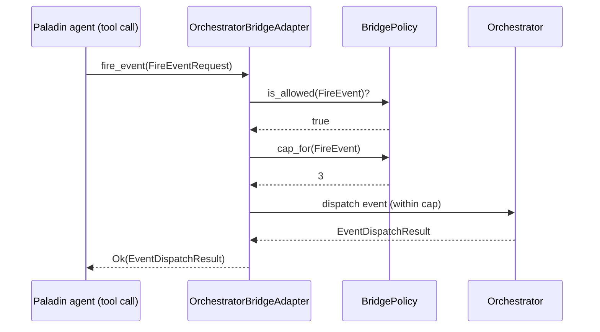
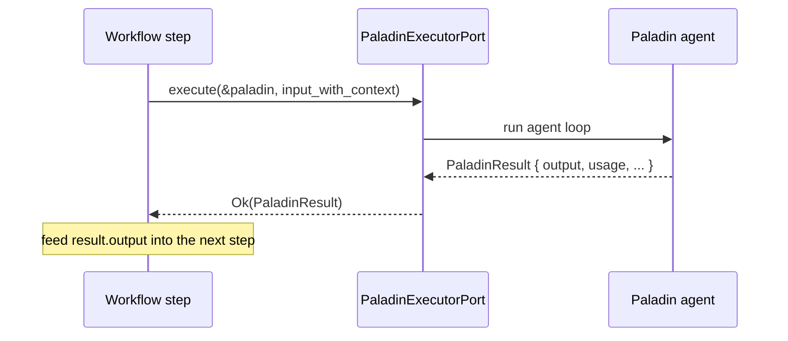

# Agent ↔ Orchestrator Bridge

Paladin agents and Battalion workflows interact **bidirectionally**:

- An **agent can trigger orchestration** — schedule a job, enqueue an item, fire an event, or
  send a notification — through a narrow, policy-guarded port.
- A **workflow can invoke an agent** — run a single Paladin or a whole Battalion as a step and
  feed its output back into the workflow.

This guide covers both directions, how to configure the bridge safely, and four end-to-end
recipes. It builds on the [Orchestration](orchestration.md) and
[Content Processing](content-processing.md) guides.

> Every example targets the current **v0.10.0** workspace. The substantive examples are real,
> compiled code pulled from the `paladin-doc-examples` crate via mdBook `{{#include}}` (one
> illustrative fragment is `rust,ignore`). API forms are verified against
> `crates/paladin-ports/src/output/orchestrator_port.rs`, `paladin_executor_port.rs`,
> `battalion_port.rs`, and the concrete `OrchestratorBridgeAdapter` in
> `src/application/services/orchestration/`.

---

## Table of Contents

1. [Agents Triggering Orchestration](#agents-triggering-orchestration)
2. [Orchestration Invoking Agents](#orchestration-invoking-agents)
3. [Configuring the Bridge](#configuring-the-bridge)
4. [Use-Case Recipes](#use-case-recipes)
5. [See Also](#see-also)

---

## Agents Triggering Orchestration

The seam is `OrchestratorPort` (`crates/paladin-ports/src/output/orchestrator_port.rs`). It
exposes exactly four actions, mirrored by the `BridgeAction` enum:

| `BridgeAction` | `OrchestratorPort` method | Request type | Returns |
|----------------|---------------------------|--------------|---------|
| `ScheduleJob` | `schedule_job` | `ScheduleJobRequest` | `Uuid` |
| `QueueItem` | `queue_item` | `QueueItemRequest` | `Uuid` |
| `FireEvent` | `fire_event` | `FireEventRequest` | `EventDispatchResult` |
| `SendNotification` | `send_notification` | `SendNotificationRequest` | `Uuid` |

The concrete adapter, `OrchestratorBridgeAdapter`, wraps an `Arc<Orchestrator>` and a
`BridgePolicy`. It enforces the policy **before** performing any underlying call, so an agent can
never exceed the actions or per-execution caps it was granted.



### Tool-based invocation from an agent loop

Expose the bridge to a Paladin as a tool. When the agent decides to act, the tool implementation
calls the relevant `OrchestratorPort` method. The agent never touches the `Orchestrator`
directly — only the policy-guarded port.

```rust
{{#include ../../../crates/doc-examples/src/bridge.rs:agent_triggers}}
```

`OrchestratorBridgeError` distinguishes `ActionNotAllowed` (the policy doesn't grant the action)
from `QuotaExceeded` (the per-execution cap is reached), so an agent can react sensibly instead
of failing opaquely.

---

## Orchestration Invoking Agents

The reverse direction uses the executor ports:

- **`PaladinExecutorPort`** (`paladin_executor_port.rs`) — run a single Paladin:
  `async fn execute(&self, paladin: &Paladin, input: &str) -> Result<PaladinResult, PaladinError>`.
- **`BattalionPort`** (`battalion_port.rs`) — run/monitor a whole Battalion by id:
  `execute(battalion_id) -> BattalionResult`, plus `status` and `cancel`.

A workflow step builds the input string (passing context from earlier steps), calls the executor,
and reads the result back out.



```rust
{{#include ../../../crates/doc-examples/src/bridge.rs:orchestration_invokes}}
```

`PaladinResult` carries `output`, `usage` (the full `TokenUsage` split), `execution_time_ms`,
`loop_count`, and `stop_reason` — everything the workflow needs to decide what to do next. To invoke a whole
Battalion instead of a single agent, use `BattalionPort::execute(battalion_id)` and read the
`BattalionResult` (see [Orchestration → Configuration Reference](orchestration.md#configuration-reference)).

---

## Configuring the Bridge

Bridge behavior is configured **programmatically** through `BridgePolicy` — there is no dedicated
`config.yml` bridge section in v0.5.0. A policy is two things: the set of *allowed* actions, and a
*per-execution cap* for each action.

```rust
{{#include ../../../crates/doc-examples/src/bridge.rs:bridge_policy}}
```

The three forms shown are: an explicit least-privilege policy, the builder-style `.allow(..)`,
and the conservative-but-usable `Default` (**all four actions, cap 3 each**). Prefer an explicit
least-privilege policy for agents you don't fully trust.

> **Tip:** because the adapter enforces the policy before every call, tightening a policy is a
> safe, local change — you don't have to audit the agent's prompt to constrain what it can do.

---

## Use-Case Recipes

### 1. News monitoring pipeline with AI analysis

`NewsApiFetcher` → AI summarization (`LlmContentAnalyzer`) → notification via the bridge.

```rust
{{#include ../../../crates/doc-examples/src/bridge.rs:recipe_news}}
```

See [Content Processing](content-processing.md) for the ingestion/analysis half and
[Orchestration → Job Scheduling](orchestration.md#job-scheduling) to run this on a cron.

### 2. Research workflow

A web/HTTP tool gathers sources, a Paladin synthesizes them, and a **Formation** assembles the
final report.

```rust,ignore
// 1. Agent gathers sources via an HTTP tool (Arsenal), producing notes.
// 2. Synthesis Paladin run as a workflow step:
let synthesis = executor.execute(&synthesizer, &collected_notes).await?;
// 3. Formation assembles intro → body → conclusion from the synthesis.
let report = formation_service.execute(&report_formation, &synthesis.output).await?;
```

### 3. Scheduled batch enrichment (job queue)

A recurring job enqueues items; a worker drains the queue and runs each through a Paladin.

```rust
{{#include ../../../crates/doc-examples/src/bridge.rs:recipe_schedule}}
```

### 4. Trigger-initiated agent run

An agent fires a domain event; a registered [Trigger](orchestration.md#event-and-trigger-system)
matches it and initiates a Paladin run — fully event-driven, no polling.

```rust
{{#include ../../../crates/doc-examples/src/bridge.rs:recipe_trigger}}
```

---

## See Also

- [Orchestration](orchestration.md) — the Battalion patterns, job scheduler, and trigger system the bridge drives.
- [Content Processing](content-processing.md) — the ingestion/analysis pipeline used in recipes 1 and 3.
- [Paladin Agents](paladin-agents.md) — building the agents on both sides of the bridge.
- [Crate Map](../api-reference/crate-map.md#paladin-ports) — where `OrchestratorPort` and the executor ports live.
