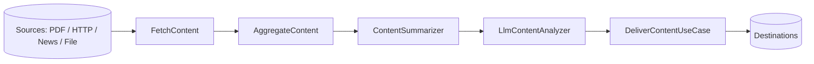

# Content Processing

The `paladin-content` crate (`crates/paladin-content/`) ingests content from external sources,
runs it through aggregation/analysis use cases, hands it to a Paladin agent for AI enrichment,
and delivers the result. This guide covers the **ingestion adapters**, the **processing
use cases**, the **content → agent bridge**, and **delivery** — documenting only what is wired
into the compiled crate today.

> Every code example targets the current **v0.10.0** workspace. The substantive examples are real,
> compiled code pulled from the `paladin-doc-examples` crate via mdBook `{{#include}}` (a few
> illustrative fragments are `rust,ignore`). The API forms are verified against
> `crates/paladin-content/src/`.

> **Feature flags.** Content processing lives behind the root `content-processing` feature,
> which enables `paladin-content`. Within the crate, `news-api` enables the News API fetcher and
> `llm` enables LLM-powered analysis. See the [Crate Map](../api-reference/crate-map.md#paladin-content)
> for the full flag table.

---

## Table of Contents

1. [Content Ingestion Sources](#content-ingestion-sources)
2. [Aggregation and the Processing Pipeline](#aggregation-and-the-processing-pipeline)
3. [Content → Agent Bridge](#content--agent-bridge)
4. [Content Delivery](#content-delivery)
5. [Capabilities and Limitations](#capabilities-and-limitations)
6. [See Also](#see-also)

---

## Content Ingestion Sources

Every fetcher produces a `ContentItem`
(`paladin_core::platform::container::content::ContentItem`), the common currency of the
pipeline. Sources are constructed and configured **programmatically** (there is no dedicated
`content:` section in `config.yml` yet — see [Limitations](#capabilities-and-limitations)).

### PDF / documents — `PdfExtractor`

`PdfExtractor` parses a PDF (from a path or raw bytes) into a `Document`. `DocumentAdapter`
wraps document parsing for the pipeline.

```rust
{{#include ../../../crates/doc-examples/src/content.rs:pdf}}
```

### HTTP endpoints — `HttpContentFetcher`

`HttpContentFetcher` fetches a URL and returns a `ContentItem`. It implements the
`ContentFetchingService` trait, so it can be driven directly or through the `FetchContent`
use case.

```rust
{{#include ../../../crates/doc-examples/src/content.rs:http}}
```

### News / feeds — `NewsApiFetcher` (feature `news-api`)

`NewsApiFetcher` polls a News API endpoint. It takes an API key and reuses an
`HttpContentFetcher` for transport.

```rust
{{#include ../../../crates/doc-examples/src/content.rs:news}}
```

### Files — `FileContentFetcher`

For local ingestion and testing, `FileContentFetcher` reads a file from disk and infers its
content type from the extension. Unlike the HTTP fetcher, it implements `ContentIngestionPort`
(`paladin_ports::input`): its `fetch_content` takes a `ContentItem` describing the source path
and returns a populated `ContentItem`. (It is an internal `#[doc(hidden)]` adapter; the primary
documented ingestion paths are HTTP, PDF, and the News API above.)

---

## Aggregation and the Processing Pipeline

Once items are fetched, the use cases combine and analyze them. Each use case is generic over a
trait, so adapters are swappable.

| Stage | Use case / type | Trait | What it does |
|-------|-----------------|-------|--------------|
| Fetch | `FetchContent<T>` | `ContentFetchingService` | URL → `ContentItem` |
| Aggregate | `AggregateContent<T>` | `ContentListService` | Combine many sources into one JSON view |
| Summarize | `ContentSummarizer` | — | Brief/detailed summaries, keyword extraction |
| Analyze | `AnalyzeContent<T>` | `ContentAnalysisService` | Run an analysis over a `ContentItem` |
| Analyze (AI) | `LlmContentAnalyzer` | — (feature `llm`) | LLM enrichment — see next section |



### Aggregation

`AggregateContent` wraps a `ContentListService` and merges a vector of JSON values into a single
aggregated value — useful for collapsing multiple fetched sources before analysis.

```rust
{{#include ../../../crates/doc-examples/src/content.rs:aggregate}}
```

### Summarization

`ContentSummarizer` produces summaries and keywords without an LLM call (deterministic
text processing), returning a `ContentSummary` plus `ContentMetadata`.

```rust
{{#include ../../../crates/doc-examples/src/content.rs:summarize}}
```

---

## Content → Agent Bridge

The `llm` feature enables `LlmContentAnalyzer`, which passes a `ContentItem` plus a prompt to a
Paladin LLM analysis service for AI enrichment. This is the seam where the content pipeline meets
the agent layer.

`LlmContentAnalyzer::analyze_with_prompt_async` takes an `LlmContentAnalysisInput`
(`prompt: PromptItem`, `content: ContentItem`) and an `LlmContentAnalysisConfig`
(model, retries, timeout, `max_content_length`), and returns the analysis as JSON.

```rust
{{#include ../../../crates/doc-examples/src/content.rs:llm_bridge}}
```

> Use the **async** method (`analyze_with_prompt_async`). The sync `analyze_with_prompt` is a
> compatibility stub that returns an error directing callers to the async path.

For richer agent interactions — an agent that *triggers* a workflow, or a workflow step that
*invokes* a full Paladin agent loop — see the
[Agent ↔ Orchestrator Bridge](agent-orchestrator-bridge.md).

---

## Content Delivery

`DeliverContentUseCase` sends processed content to a destination through the
`ContentDeliveryService` port (`paladin_ports::output::content_delivery_port`). It takes a
`DeliveryRequest` and returns a `DeliveryResponse` (with a `DeliveryStatus`).

```rust
{{#include ../../../crates/doc-examples/src/content.rs:delivery}}
```

For push/email/system notification of delivered content, wire the delivery adapter to the
notification adapters (`paladin-notifications`) or fire a notification through the orchestrator
bridge — see the [bridge recipes](agent-orchestrator-bridge.md#use-case-recipes).

---

## Capabilities and Limitations

The crate's manifest declares some features whose adapters are **not yet implemented** in
v0.10.0. To keep this guide honest:

| Capability | Status |
|------------|--------|
| PDF extraction (`PdfExtractor`) | ✅ Implemented |
| HTTP fetching (`HttpContentFetcher`) | ✅ Implemented |
| News API ingestion (`NewsApiFetcher`, feature `news-api`) | ✅ Implemented |
| File / local ingestion | ✅ Implemented |
| Aggregation, summarization, analysis use cases | ✅ Implemented |
| LLM content analysis (`LlmContentAnalyzer`, feature `llm`) | ✅ Implemented |
| Content delivery (`DeliverContentUseCase`) | ✅ Implemented |
| **Web scraping** (`web-scraping` feature) | ⚠️ Feature/dep declared, **no adapter yet** |
| **RSS/Atom feeds** (`rss` feature) | ⚠️ Feature/dep declared, **no adapter yet** |
| **Filtering & deduplication** (`content_filtering_service`) | ⚠️ Module present but **disabled** (not compiled) |

For web-scraping and RSS today, fetch the raw resource with `HttpContentFetcher` and parse it in
your own adapter. Filtering/dedup must likewise be done in caller code until the
`content_filtering_service` module is completed and re-enabled.

---

## See Also

- [Agent ↔ Orchestrator Bridge](agent-orchestrator-bridge.md) — end-to-end recipes combining content ingestion with agent analysis and notification.
- [Orchestration](orchestration.md) — running the analysis Paladin inside a Battalion workflow.
- [Paladin Agents](paladin-agents.md) — building the Paladin that performs the AI enrichment.
- [Crate Map](../api-reference/crate-map.md#paladin-content) — `paladin-content` exports and feature flags.
