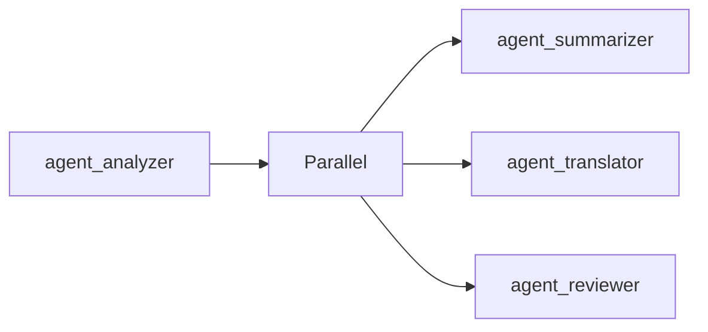
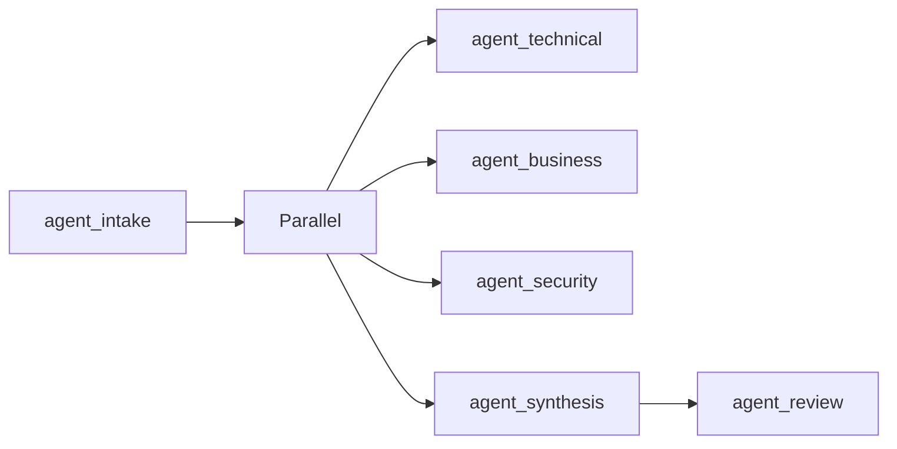

# Maneuver: Flow DSL Orchestration

**Declarative multi-agent workflows with dynamic execution patterns**

---

## Table of Contents

1. [Overview](#overview)
2. [Quick Start](#quick-start)
3. [Flow DSL Syntax](#flow-dsl-syntax)
4. [Execution Patterns](#execution-patterns)
5. [Configuration](#configuration)
6. [CLI Commands](#cli-commands)
7. [Visualization](#visualization)
8. [Error Handling](#error-handling)
9. [Performance](#performance)
10. [Best Practices](#best-practices)
11. [API Reference](#api-reference)
12. [Troubleshooting](#troubleshooting)

---

## Overview

Maneuver is a declarative Battalion orchestration pattern that uses a Flow DSL (Domain-Specific Language) to define complex agent execution patterns. Unlike other Battalion patterns that require explicit code, Maneuver allows you to express workflows as simple text expressions.

### Key Features

- **Declarative Syntax**: Define workflows as text expressions (`agent1 -> agent2`)
- **Mixed Patterns**: Combine sequential and parallel execution in a single flow
- **Visual Feedback**: ASCII and Mermaid.js visualization of flow graphs
- **Type-Safe Parsing**: Compile-time validation of flow expressions
- **Commander Integration**: Automatic pattern detection for "flow" keywords

### Comparison with Other Patterns

| Pattern | Definition Style | Flexibility | Complexity | Visualization |
|---------|-----------------|-------------|------------|---------------|
| **Formation** | Programmatic | Sequential only | Low | ❌ |
| **Phalanx** | Programmatic | Parallel only | Low | ❌ |
| **Campaign** | Graph/DAG | High | High | Limited |
| **Maneuver** | **DSL Text** | **High** | **Medium** | **✅ ASCII/Mermaid** |

---

## Quick Start

### Installation

Maneuver is included in `paladin-battalion`. Add it to your workspace:

```toml
[dependencies]
paladin-battalion = { version = "0.10.0", path = "crates/paladin-battalion" }
tokio = { version = "1.0", features = ["full"] }
```

### Basic Example

```rust,ignore
use paladin_battalion::maneuver::service::ManeuverExecutionService;
use paladin_battalion::maneuver::Maneuver;
use paladin_battalion::maneuver::parser::FlowParser;
use std::collections::HashMap;
use std::sync::Arc;

#[tokio::main]
async fn main() -> Result<(), Box<dyn std::error::Error>> {
    // Define flow using DSL
    let flow = FlowParser::parse("analyzer -> summarizer -> reviewer")?;

    // Create Paladins
    let mut agents = HashMap::new();
    agents.insert("analyzer".to_string(), create_paladin("analyzer", "Analyze input"));
    agents.insert("summarizer".to_string(), create_paladin("summarizer", "Summarize"));
    agents.insert("reviewer".to_string(), create_paladin("reviewer", "Final review"));

    // Create Maneuver
    let maneuver = Maneuver::new("doc-workflow", agents, flow, Default::default())?;

    // Execute
    let service = ManeuverExecutionService::new(Arc::new(paladin_port));
    let result = service.execute(&maneuver, "Document to process").await?;

    println!("Final output: {}", result.final_output);
    Ok(())
}
```

### CLI Quick Start

```bash
# Create a Maneuver configuration
paladin battalion new --name my-workflow --type maneuver -o workflow.yaml

# Visualize the flow
paladin maneuver visualize -c workflow.yaml --format ascii

# Validate configuration
paladin maneuver validate -c workflow.yaml --verbose

# Execute the workflow (there is no -i/--input flag on `battalion run` —
# it prompts "Enter input for maneuver" interactively on stdin)
paladin battalion run -c workflow.yaml -t maneuver
```

---

## Flow DSL Syntax

The Flow DSL uses a simple, intuitive syntax for defining agent execution patterns.

### Basic Syntax

#### Sequential Execution

```
agent1 -> agent2 -> agent3
```

Output from `agent1` flows as input to `agent2`, then to `agent3`.

#### Parallel Execution

```
(agent1, agent2)
```

Both `agent1` and `agent2` execute concurrently with the same input.

**Note**: Use commas (`,`) for parallel, not pipes (`|`).

#### Nested Patterns

```
agent1 -> (agent2, agent3) -> agent4
```

1. `agent1` executes first
2. Output flows to both `agent2` and `agent3` (parallel)
3. Combined output flows to `agent4`

### Syntax Rules

| Element | Syntax | Example | Description |
|---------|--------|---------|-------------|
| **Agent** | `name` | `analyzer` | Alphanumeric identifier |
| **Sequential** | `->` | `a -> b` | Arrow operator |
| **Parallel** | `,` | `(a, b)` | Comma separator |
| **Grouping** | `()` | `(a, b)` | Parentheses for precedence |

### Valid Examples

```
# Simple sequential
agent1 -> agent2

# Simple parallel
(agent1, agent2)

# Mixed nested
start -> (analyzer, reviewer) -> end

# Complex workflow
intake -> (technical, business, security) -> synthesis -> review

# Deep nesting
a -> (b -> (c, d), e) -> f
```

### Invalid Syntax

```
# ❌ Pipe operator (use comma instead)
(agent1 | agent2)

# ❌ Missing parentheses for parallel
agent1 -> agent2, agent3

# ❌ Spaces in agent names
my agent -> another agent

# ❌ Empty groups
() -> agent1

# ❌ Trailing operators
agent1 ->
```

---

## Execution Patterns

### Sequential Pattern

**Flow**: `agent1 -> agent2 -> agent3`

**Behavior**:
1. Execute `agent1` with initial input
2. Pass `agent1` output to `agent2` as input
3. Pass `agent2` output to `agent3` as input
4. Return `agent3` output as final result

**Use Cases**:
- Data transformation pipelines
- Multi-stage analysis
- Progressive refinement

**Example**:
```rust,ignore
// Flow: "extractor -> translator -> formatter"
let flow = FlowParser::parse("extractor -> translator -> formatter")?;

// Input: "Extract data from: <raw_text>"
// extractor output: "Data: {...}"
// translator output: "Translated: {...}"
// formatter output: "Formatted report: {...}" (final)
```

### Parallel Pattern

**Flow**: `(agent1, agent2, agent3)`

**Behavior**:
1. Execute all agents concurrently with same input
2. Wait for all to complete
3. Combine outputs (concatenation or custom logic)
4. Return combined result

**Use Cases**:
- Multi-perspective analysis
- Expert panel reviews
- Parallel processing

**Example**:
```rust,ignore
// Flow: "(tech_reviewer, business_reviewer, security_reviewer)"
let flow = FlowParser::parse("(tech_reviewer, business_reviewer, security_reviewer)")?;

// All receive: "Review this proposal: {...}"
// Output combines all three perspectives
```

### Nested Pattern

**Flow**: `agent1 -> (agent2, agent3) -> agent4`

**Behavior**:
1. Execute `agent1` with initial input
2. Pass output to both `agent2` and `agent3` (parallel)
3. Wait for both to complete
4. Combine their outputs
5. Pass combined result to `agent4`
6. Return `agent4` output as final result

**Use Cases**:
- Divide-and-conquer workflows
- Multi-faceted analysis with synthesis
- Complex decision trees

**Example**:
```rust,ignore
// Flow: "analyzer -> (summarizer, translator) -> reviewer"
let flow = FlowParser::parse("analyzer -> (summarizer, translator) -> reviewer")?;

// 1. analyzer processes input
// 2. summarizer + translator work in parallel on analysis
// 3. reviewer synthesizes both outputs into final result
```

### Execution Order Visualization

```
Sequential: agent1 → agent2 → agent3
           t₀      t₁      t₂

Parallel:   agent1
           ↙      ↘
       agent2    agent3
           ↘      ↙
         (combine)

Nested:     agent1
              ↓
          ┌───┴───┐
      agent2   agent3
          └───┬───┘
           agent4
```

---

## Configuration

### Maneuver Configuration

```rust,ignore
use paladin_battalion::maneuver::{ManeuverConfig, ErrorStrategy, OutputFormat};
use std::time::Duration;

let config = ManeuverConfig::new()
    .with_error_strategy(ErrorStrategy::ContinueParallel)
    .with_output_format(OutputFormat::Concatenate)
    .with_pass_output_as_input(true)
    .with_timeout(Duration::from_secs(300))
    .with_timing_metrics(true);

let maneuver = Maneuver::new("workflow", agents, flow, config)?;
```

### Error Strategies

```rust,ignore
pub enum ErrorStrategy {
    /// Stop immediately on first error
    FailFast,

    /// Continue parallel branches but fail sequential chains on error
    ContinueParallel,

    /// Log errors but continue execution regardless
    IgnoreErrors,
}
```

**When to Use**:
- **FailFast**: Critical workflows where any failure invalidates the result
- **ContinueParallel**: Parallel sections can fail independently
- **IgnoreErrors**: Best-effort workflows, collect whatever partial results are available

### Output Formats

```rust,ignore
pub enum OutputFormat {
    /// Concatenate all outputs with newlines (default)
    Concatenate,

    /// JSON array with each agent's output as an element
    JsonArray,
}
```

**Example Outputs**:

```rust,ignore
// Concatenate (default)
"Output from agent1\n---\nOutput from agent2\n---\nOutput from agent3"

// JsonArray
r#"["output from agent1", "output from agent2", "output from agent3"]"#
```

### YAML Configuration

```yaml
type: maneuver
name: "document-workflow"

# Flow expression using DSL
flow: "analyzer -> (summarizer, translator) -> reviewer"

# Available Paladins (must match names in flow)
paladins:
  - inline:
      name: "analyzer"
      system_prompt: "Analyze the input document"
      model: "gpt-4"
      temperature: 0.7
      provider:
        type: openai

  - inline:
      name: "summarizer"
      system_prompt: "Create a concise summary"
      model: "gpt-4"
      temperature: 0.5
      provider:
        type: openai

  - inline:
      name: "translator"
      system_prompt: "Translate to simple language"
      model: "gpt-4"
      temperature: 0.5
      provider:
        type: openai

  - inline:
      name: "reviewer"
      system_prompt: "Final review and synthesis"
      model: "gpt-4"
      temperature: 0.6
      provider:
        type: openai

# Optional: visualize before execution
visualize: "ascii"
```

---

## CLI Commands

### Create Maneuver Configuration

```bash
paladin battalion new --name my-workflow --type maneuver --output workflow.yaml
```

Creates a template YAML file with example flow and agents.

### Visualize Flow

```bash
# ASCII tree visualization
paladin maneuver visualize -c workflow.yaml --format ascii

# Mermaid flowchart (for documentation)
paladin maneuver visualize -c workflow.yaml --format mermaid

# Save to file
paladin maneuver visualize -c workflow.yaml --format ascii -o flow.txt
```

**Output Example (ASCII)**:
```
└─> analyzer
    ├─> [PARALLEL]
    │   ├─> summarizer
    │   └─> translator
    └─> reviewer
```

**Output Example (Mermaid)**:


### Validate Configuration

```bash
# Basic validation
paladin maneuver validate -c workflow.yaml

# Verbose validation with detailed output
paladin maneuver validate -c workflow.yaml --verbose
```

**Validates**:
- Flow expression syntax
- All agents referenced in flow exist in config
- Paladin configuration structure
- Provider settings

### Execute Maneuver

```bash
# Interactive execution — prompts "Enter input for maneuver" on stdin;
# `battalion run` has no -i/--input flag
paladin battalion run -c workflow.yaml -t maneuver

# Save output to file
paladin battalion run -c workflow.yaml -t maneuver -o result.json

# Verbose execution
paladin battalion run -c workflow.yaml -t maneuver -v
```

---

## Visualization

### ASCII Tree Format

Perfect for terminal output and debugging:

```
└─> intake
    ├─> [PARALLEL]
    │   ├─> technical
    │   ├─> business
    │   └─> security
    └─> synthesis
        └─> review
```

**Features**:
- Box-drawing characters (├─>, └─>, │)
- Clear hierarchy visualization
- Sequential and parallel markers
- Nested structure representation

### Mermaid Flowchart Format

Ideal for documentation and presentations:



**Features**:
- Web-ready visualization
- Integrates with GitHub/GitLab/documentation tools
- Professional diagram quality
- Exportable to SVG/PNG

### Programmatic Visualization

```rust,ignore
use paladin_battalion::maneuver::visualizer::{FlowVisualizer, VisualizationFormat};

let flow = FlowParser::parse("a -> (b, c) -> d")?;

// ASCII visualization
let ascii = FlowVisualizer::to_ascii(&flow);
println!("{}", ascii);

// Mermaid visualization
let mermaid = FlowVisualizer::to_mermaid(&flow);
println!("{}", mermaid);

// Using format parameter
let viz = FlowVisualizer::visualize(&flow, VisualizationFormat::Ascii);
```

---

## Error Handling

### Validation Errors

```rust,ignore
use paladin_battalion::maneuver::parser::FlowParseError;

match FlowParser::parse("agent1 -> (agent2 | agent3)") {
    Ok(flow) => { /* Success */ },
    Err(FlowParseError::InvalidCharacter { position, character }) => {
        eprintln!("Invalid character '{}' at position {}", character, position);
        // Error: Invalid character '|' at position 17
    },
    Err(e) => eprintln!("Parse error: {}", e),
}
```

### Execution Errors

```rust,ignore
use paladin_battalion::maneuver::ManeuverError;

match service.execute(&maneuver, input).await {
    Ok(result) => println!("Success: {}", result.final_output),
    Err(ManeuverError::AgentNotFound { agent_name, available_agents }) => {
        eprintln!("Agent '{}' not found. Available: {:?}", agent_name, available_agents);
    },
    Err(ManeuverError::ExecutionError(msg)) => {
        eprintln!("Execution failed: {}", msg);
    },
    Err(e) => eprintln!("Error: {}", e),
}
```

### Error Recovery

```rust,ignore
// Configure error handling strategy
let config = ManeuverConfig::new()
    .with_error_strategy(ErrorStrategy::IgnoreErrors);

// Execution continues despite failures
let result = service.execute(&maneuver, input).await?;

// Check status
match result.status {
    ExecutionStatus::Success => println!("All agents succeeded"),
    ExecutionStatus::PartialSuccess => println!("Some agents failed"),
    ExecutionStatus::Failed => println!("Execution failed"),
}

// Inspect individual outputs
for (agent, output) in result.step_outputs {
    if output.is_empty() {
        println!("Agent {} failed", agent);
    }
}
```

---

## Performance

### Benchmarks

Based on `battalion_benchmarks.rs`:

| Metric | Value | Notes |
|--------|-------|-------|
| **Parse Time** | <1ms | Average for typical flows |
| **Validation** | <0.5ms | Per agent validation |
| **Overhead** | 10-50ms | Framework overhead only |
| **Sequential (3 agents)** | ~3-5s | Depends on LLM latency |
| **Parallel (3 agents)** | ~1-2s | Concurrent execution |

### Optimization Tips

#### 1. Minimize Sequential Chains

❌ **Slow**: `a -> b -> c -> d -> e -> f` (6 sequential calls)

✅ **Fast**: `a -> (b, c, d) -> e` (3 stages total)

#### 2. Use Parallel Where Possible

```rust,ignore
// Slow: Sequential when order doesn't matter
"tech_review -> security_review -> legal_review"

// Fast: Parallel independent reviews
"(tech_review, security_review, legal_review)"
```

#### 3. Configure Timeouts

```rust,ignore
let config = ManeuverConfig::new()
    .with_timeout(Duration::from_secs(120))  // Per-agent timeout
    .with_error_strategy(ErrorStrategy::ContinueParallel);  // Don't wait for failures
```

#### 4. Optimize Agent Prompts

- Keep system prompts concise
- Use lower `max_loops` values when possible
- Set appropriate temperature values

#### 5. Monitor Timing Metrics

```rust,ignore
let config = ManeuverConfig::new()
    .with_timing_metrics(true);

let result = service.execute(&maneuver, input).await?;

if let Some(metrics) = result.timing_metrics {
    for (agent, duration) in metrics {
        println!("{}: {}ms", agent, duration.as_millis());
    }
}
```

---

## Best Practices

### 1. Flow Design

#### Keep Flows Simple
```rust,ignore
// ✅ Good: Clear, easy to understand
"intake -> analyze -> decide"

// ❌ Bad: Too complex, hard to debug
"a -> (b -> (c, d -> (e, f)), g -> (h, i)) -> j"
```

#### Use Descriptive Names
```rust,ignore
// ✅ Good: Clear purpose
"document_analyzer -> sentiment_classifier -> report_generator"

// ❌ Bad: Cryptic names
"agent1 -> agent2 -> agent3"
```

### 2. Agent Configuration

#### Specialize Agents
Each agent should have a clear, focused responsibility:

```yaml
- name: "analyzer"
  system_prompt: "Analyze technical feasibility only. Focus on implementation challenges."

- name: "risk_assessor"
  system_prompt: "Assess security and privacy risks only."

- name: "synthesizer"
  system_prompt: "Combine technical analysis and risk assessment into recommendation."
```

#### Use Consistent Naming
Match agent names in flow expression exactly:

```rust,ignore
// Flow uses: analyzer, summarizer, reviewer
flow: "analyzer -> summarizer -> reviewer"

// Paladins must use same names:
agents.insert("analyzer", ...);
agents.insert("summarizer", ...);
agents.insert("reviewer", ...);
```

### 3. Error Handling

#### Always Handle Errors
```rust,ignore
// ✅ Good: Explicit error handling
match service.execute(&maneuver, input).await {
    Ok(result) => process_result(result),
    Err(ManeuverError::AgentNotFound { agent_name, .. }) => {
        log_error!("Missing agent: {}", agent_name);
        return default_result();
    },
    Err(e) => {
        log_error!("Execution failed: {}", e);
        retry_with_fallback();
    },
}

// ❌ Bad: Unwrapping
let result = service.execute(&maneuver, input).await.unwrap();
```

#### Choose Appropriate Strategy
```rust,ignore
// Critical workflows: fail fast
let config = ManeuverConfig::new()
    .with_error_strategy(ErrorStrategy::FailFast);

// Best-effort workflows: collect partial results
let config = ManeuverConfig::new()
    .with_error_strategy(ErrorStrategy::IgnoreErrors);
```

### 4. Testing

#### Validate Flows Early
```rust,ignore
#[test]
fn test_workflow_validation() {
    let flow = FlowParser::parse("analyzer -> summarizer").unwrap();

    let mut agents = HashMap::new();
    agents.insert("analyzer".to_string(), create_test_agent("analyzer"));
    agents.insert("summarizer".to_string(), create_test_agent("summarizer"));

    let result = Maneuver::new("test", agents, flow, Default::default());
    assert!(result.is_ok());
}
```

#### Test Visualizations
```rust,ignore
#[test]
fn test_flow_visualization() {
    let flow = FlowParser::parse("a -> (b, c)").unwrap();
    let ascii = FlowVisualizer::to_ascii(&flow);

    assert!(ascii.contains("PARALLEL"));
    assert!(ascii.contains("a"));
    assert!(ascii.contains("b"));
    assert!(ascii.contains("c"));
}
```

### 5. Documentation

#### Document Complex Flows
```yaml
# Flow explanation:
# 1. Intake agent validates and normalizes input
# 2. Three specialists analyze in parallel:
#    - Technical feasibility
#    - Business value
#    - Security implications
# 3. Synthesis agent combines all perspectives
# 4. Final review for quality assurance
flow: "intake -> (technical, business, security) -> synthesis -> review"
```

---

## API Reference

### Core Types

#### FlowParser

```rust,ignore
pub struct FlowParser;

impl FlowParser {
    /// Parse a flow expression from text
    pub fn parse(input: &str) -> Result<FlowExpression, FlowParseError>
}
```

#### FlowExpression

```rust,ignore
#[derive(Debug, Clone, PartialEq, Eq)]
pub enum FlowExpression {
    /// Single agent execution
    Agent(String),

    /// Sequential execution (agent₁ → agent₂ → ...)
    Sequential(Vec<FlowExpression>),

    /// Parallel execution (agent₁, agent₂, ...)
    Parallel(Vec<FlowExpression>),
}

impl FlowExpression {
    /// Get all agent names referenced in this expression
    pub fn agent_names(&self) -> Vec<String>
}
```

#### Maneuver

```rust,ignore
pub struct Maneuver {
    pub name: String,
    pub agents: HashMap<String, Paladin>,
    pub flow: FlowExpression,
    pub config: ManeuverConfig,
}

impl Maneuver {
    /// Create a new Maneuver with validation
    pub fn new(
        name: impl Into<String>,
        agents: HashMap<String, Paladin>,
        flow: FlowExpression,
        config: ManeuverConfig,
    ) -> Result<Self, ManeuverError>

    /// Validate that all flow agents exist
    pub fn validate(&self) -> Result<(), ManeuverError>
}
```

#### ManeuverConfig

```rust,ignore
pub struct ManeuverConfig {
    pub error_strategy: ErrorStrategy,
    pub output_format: OutputFormat,
    pub pass_output_as_input: bool,
    pub timeout: Option<Duration>,
    pub collect_timing_metrics: bool,
    pub detailed_observability: bool,
}

impl ManeuverConfig {
    pub fn new() -> Self
    pub fn with_error_strategy(self, strategy: ErrorStrategy) -> Self
    pub fn with_output_format(self, format: OutputFormat) -> Self
    pub fn with_timeout(self, timeout: Duration) -> Self
}
```

#### ManeuverResult

```rust,ignore
pub struct ManeuverResult {
    /// Final aggregated output
    pub final_output: String,

    /// Individual agent outputs
    pub step_outputs: HashMap<String, String>,

    /// Execution order
    pub execution_order: Vec<String>,

    /// Per-agent timing (if enabled)
    pub timing_metrics: Option<HashMap<String, Duration>>,

    /// Execution status
    pub status: ExecutionStatus,
}
```

#### ManeuverExecutionService

```rust,ignore
pub struct ManeuverExecutionService {
    paladin_port: Arc<dyn PaladinPort>,
}

impl ManeuverExecutionService {
    pub fn new(paladin_port: Arc<dyn PaladinPort>) -> Self

    pub async fn execute(
        &self,
        maneuver: &Maneuver,
        input: &str,
    ) -> Result<ManeuverResult, ManeuverError>
}
```

### Visualization

#### FlowVisualizer

```rust,ignore
pub struct FlowVisualizer;

impl FlowVisualizer {
    /// Generate ASCII tree visualization
    pub fn to_ascii(flow: &FlowExpression) -> String

    /// Generate Mermaid flowchart
    pub fn to_mermaid(flow: &FlowExpression) -> String

    /// Generate visualization in specified format
    pub fn visualize(flow: &FlowExpression, format: VisualizationFormat) -> String
}

pub enum VisualizationFormat {
    Ascii,
    Mermaid,
}
```

---

## Troubleshooting

### Common Issues

#### 1. Parse Error: Invalid Character '|'

**Problem**: Using pipe operator for parallel execution

```rust,ignore
// ❌ Wrong
let flow = FlowParser::parse("(agent1 | agent2)")?;
```

**Solution**: Use comma instead

```rust,ignore
// ✅ Correct
let flow = FlowParser::parse("(agent1, agent2)")?;
```

#### 2. AgentNotFound Error

**Problem**: Agent name in flow doesn't match configured agents

```rust,ignore
// Flow references "analyzer"
let flow = FlowParser::parse("analyzer -> summarizer")?;

// But agent is named "Analyzer" (different case)
agents.insert("Analyzer".to_string(), paladin);
```

**Solution**: Use exact same names

```rust,ignore
// ✅ Correct - exact match
agents.insert("analyzer".to_string(), paladin);
```

#### 3. Missing Parentheses for Parallel

**Problem**: Forgetting parentheses around parallel agents

```rust,ignore
// ❌ Wrong - will be parsed as "agent1 -> agent2", "agent3"
let flow = FlowParser::parse("agent1 -> agent2, agent3")?;
```

**Solution**: Always use parentheses for parallel

```rust,ignore
// ✅ Correct
let flow = FlowParser::parse("agent1 -> (agent2, agent3)")?;
```

#### 4. Timeout Errors

**Problem**: Agents taking too long to execute

```rust,ignore
// Default timeout may be too short
let config = ManeuverConfig::default();  // 300s default
```

**Solution**: Increase timeout for slow workflows

```rust,ignore
// ✅ Longer timeout
let config = ManeuverConfig::new()
    .with_timeout(Duration::from_secs(600));  // 10 minutes
```

#### 5. Partial Results from Parallel Execution

**Problem**: Some agents fail in parallel execution

**Solution**: Use appropriate error strategy

```rust,ignore
// Continue despite failures
let config = ManeuverConfig::new()
    .with_error_strategy(ErrorStrategy::ContinueParallel);

let result = service.execute(&maneuver, input).await?;

// Check which agents succeeded
for (agent, output) in result.step_outputs {
    if !output.is_empty() {
        println!("{} succeeded: {}", agent, output);
    }
}
```

### Debugging Tips

#### 1. Enable Verbose Logging

```rust,ignore
env_logger::init();  // In main()

// Set RUST_LOG=debug
// Will show detailed execution trace
```

#### 2. Visualize Before Executing

```bash
paladin maneuver visualize -c config.yaml --format ascii
```

Visual inspection often reveals flow logic issues.

#### 3. Validate Configuration

```bash
paladin maneuver validate -c config.yaml --verbose
```

Catches configuration mismatches before execution.

#### 4. Check Timing Metrics

```rust,ignore
let config = ManeuverConfig::new()
    .with_timing_metrics(true);

let result = service.execute(&maneuver, input).await?;

if let Some(metrics) = result.timing_metrics {
    for (agent, duration) in metrics {
        if duration > Duration::from_secs(60) {
            println!("⚠️  {} took {}s", agent, duration.as_secs());
        }
    }
}
```

#### 5. Inspect Individual Outputs

```rust,ignore
let result = service.execute(&maneuver, input).await?;

// Check each agent's output
for agent in result.execution_order {
    if let Some(output) = result.step_outputs.get(&agent) {
        println!("\n=== {} ===", agent);
        println!("{}", output);
    }
}
```

### Getting Help

- **Documentation**: https://github.com/DF3NDR/paladin-dev-env/docs
- **Issues**: https://github.com/DF3NDR/paladin-dev-env/issues
- **Discussions**: https://github.com/DF3NDR/paladin-dev-env/discussions
- **Examples**: `examples/` directory in repository

---

## Advanced Topics

### Custom Output Formatting

```rust,ignore
use paladin_battalion::maneuver::OutputFormat;

// Implement custom aggregation logic
let config = ManeuverConfig::new()
    .with_output_format(OutputFormat::JsonArray);

// Result will be JSON:
// {"agent1": "output1", "agent2": "output2"}
```

### Integration with Commander

Commander automatically detects Maneuver patterns:

```rust,ignore
use paladin_battalion::commander::CommanderBuilder;
use paladin_core::platform::container::battalion::BattalionStrategy;

// Maneuver is explicit-only — it is NOT selected by Auto mode.
// You must explicitly set BattalionStrategy::Maneuver and provide a flow expression.
let commander = CommanderBuilder::new(paladin_port)
    .strategy(BattalionStrategy::Maneuver)
    .paladins(paladins)
    .flow("agent1 -> agent2 -> agent3".to_string())
    .build()?;

let result = commander.execute("Process this document").await?;
```

### Performance Tuning

For high-throughput systems:

```rust,ignore
// Minimize overhead
let config = ManeuverConfig::new()
    .with_timing_metrics(false)  // Disable if not needed
    .with_detailed_observability(false)  // Reduce logging
    .with_error_strategy(ErrorStrategy::FailFast);  // Fast failure

// Use connection pooling for LLM providers
// Pre-validate flows at startup
// Cache parsed flow expressions
```

---

**Last Updated**: February 2026
**Version**: 0.10.0
**Status**: Production Ready
