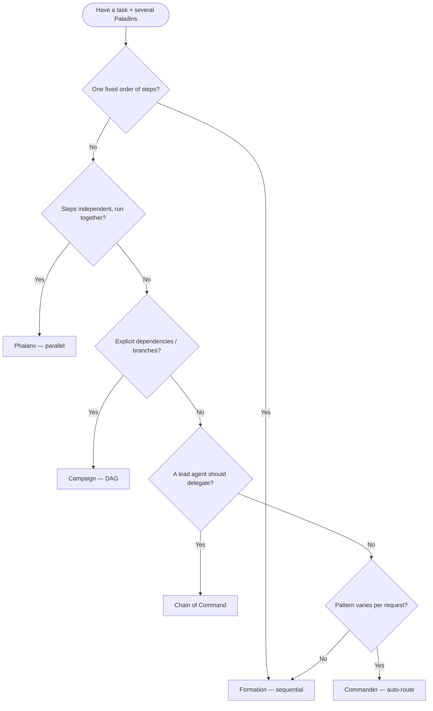

# Orchestration

The **Battalion** runtime in `crates/paladin-battalion/` coordinates multiple Paladin agents
through a family of orchestration patterns, a strategy router (**Commander**), a cron-style
**job scheduler**, and an **event/trigger** system. This guide is the comprehensive reference
for choosing a pattern and wiring it up.

For a quick pattern-by-pattern cheat sheet see [Battalion Patterns](battalion-patterns.md);
for the declarative flow language see [Maneuver Flow DSL](maneuver-flow-dsl.md); for how agents
and workflows call each other see the [Agent ↔ Orchestrator Bridge](agent-orchestrator-bridge.md).
For how a Battalion fits among the ways to *run* agents, see
[Deployment Topologies](../deployment-topologies/overview.md).

> Every code example targets the current **v0.10.0** workspace. The substantive examples are real,
> compiled code pulled from the `paladin-doc-examples` crate via mdBook `{{#include}}`, so they are
> checked against the live API; a few illustrative fragments are marked `rust,ignore`. The API forms
> are verified against `crates/paladin-battalion/` and `crates/paladin-ports/`.

---

## Table of Contents

1. [Workflow Patterns Overview](#workflow-patterns-overview)
2. [Formation — Sequential](#formation--sequential)
3. [Phalanx — Parallel](#phalanx--parallel)
4. [Campaign — Graph / DAG](#campaign--graph--dag)
5. [Chain of Command — Hierarchical](#chain-of-command--hierarchical)
6. [Commander — Dynamic Strategy Routing](#commander--dynamic-strategy-routing)
7. [Job Scheduling](#job-scheduling)
8. [Event and Trigger System](#event-and-trigger-system)
9. [Configuration Reference](#configuration-reference)
10. [See Also](#see-also)

---

## Workflow Patterns Overview

All orchestration services depend only on `Arc<dyn PaladinPort>` (from `paladin-ports`) — they
never import an LLM provider crate directly. Pick a pattern by the *shape* of the work:

| Pattern | Service | Execution model | Use when |
|---------|---------|-----------------|----------|
| **Formation** | `FormationExecutionService` | Sequential, output N → input N+1 | Multi-step pipelines where each stage refines the previous |
| **Phalanx** | `PhalanxExecutionService` | Concurrent, same input to all | Independent analyses you want fanned out in parallel |
| **Campaign** | `CampaignExecutionService` | DAG / topological | Branching workflows with explicit dependencies |
| **Chain of Command** | `ChainOfCommandExecutionService` | Hierarchical delegation | A commander decomposing work to specialists |
| **Commander** | `Commander` / `CommanderBuilder` | Auto-routes to a pattern | The right pattern varies per request |

> Conclave (mixture-of-experts), Council (turn-taking discussion), and Grove (semantic routing)
> are additional patterns documented in [Battalion Patterns](battalion-patterns.md). The
> declarative **Maneuver** flow DSL has its own guide: [Maneuver Flow DSL](maneuver-flow-dsl.md).

### Decision Flowchart



---

## Formation — Sequential

**Source:** `crates/paladin-battalion/src/formation_service.rs`

Each Paladin's output becomes the next Paladin's input. Ideal for refinement pipelines
(extract → analyze → write). If a stage fails, the configured `ErrorStrategy` decides whether
the chain short-circuits (`FailFast`, the default) or continues.

```rust
{{#include ../../../crates/doc-examples/src/orchestration.rs:formation}}
```

**Error handling / short-circuit:** with `ErrorStrategy::FailFast` the first failing stage stops
the Formation and returns the error. With `ContinueOnError`, a failed stage is skipped and its
input is passed through to the next stage. Keep chains short (≤5) for latency-sensitive paths —
each stage is one sequential LLM round-trip.

---

## Phalanx — Parallel

**Source:** `crates/paladin-battalion/src/phalanx_service.rs`

Every Paladin receives the **same** input and runs concurrently on `tokio` tasks. Results are
combined according to an `AggregationStrategy`, and concurrency is bounded by
`Phalanx::with_max_concurrency` so you don't exceed LLM rate limits.

```rust
{{#include ../../../crates/doc-examples/src/orchestration.rs:phalanx}}
```

`AggregationStrategy` variants: `CollectAll` (gather all outputs), `FirstSuccess` (first to
finish wins), `Majority` (consensus), and `Custom(String)`.

---

## Campaign — Graph / DAG

**Source:** `crates/paladin-battalion/src/campaign_service.rs`

Paladins are arranged in a directed acyclic graph. The service topologically sorts the graph so
every upstream node completes before its downstream nodes start; independent branches run
concurrently. `Campaign::build()` rejects cycles.

```rust
{{#include ../../../crates/doc-examples/src/orchestration.rs:campaign}}
```

Paladins are added with `add_paladin` (returning a `Uuid`), wired with `add_edge` using
`CampaignEdge::new(source, target, condition)`, and the graph's start is set with
`set_entry_point`. Use `EdgeCondition::Contains`/`Regex` for conditional branching; `validate()`
(called by `execute`) rejects cycles.

---

## Chain of Command — Hierarchical

**Source:** `crates/paladin-battalion/src/chain_of_command_service.rs`

A **commander** Paladin decomposes the task, routes sub-tasks to specialist (subordinate)
Paladins, and synthesizes their outputs into a final answer.

```rust
{{#include ../../../crates/doc-examples/src/orchestration.rs:chain_of_command}}
```

The service returns a `DelegationResult` with `selected_specialists`, `reasoning`, and the
specialists' `outputs`. Give each subordinate a distinct `agent_description` so the commander can
route accurately.

---

## Commander — Dynamic Strategy Routing

**Source:** `crates/paladin-battalion/src/commander.rs`

The Commander is a single entry-point that **selects a pattern automatically** (Auto mode) based
on the input text and the number/capabilities of the Paladins, or runs an **explicit** strategy
you name. It also collects rich telemetry and can export execution metadata to JSON.

### Auto mode

```rust
{{#include ../../../crates/doc-examples/src/orchestration.rs:commander}}
```

### Explicit strategy

```rust,ignore
let commander = CommanderBuilder::new(paladin_port)
    .strategy(BattalionStrategy::Formation) // force a specific pattern
    .paladins(pipeline_paladins)
    .build()?;
let result = commander.execute(input).await?;
```

### Auto-mode heuristics (first match wins)

| Priority | Strategy | Trigger keywords | Min Paladins |
|----------|----------|------------------|--------------|
| 1 | **Conclave** | synthesize, compare, perspectives, consensus, aggregate | 3+ |
| 2 | **Council** | discuss, debate, deliberate, brainstorm, dialogue | 2+ |
| 3 | **Grove** | route, best agent, expertise, most qualified | 2+ |
| 4 | **Campaign** | workflow, graph, conditional, depends on, multi-stage | any |
| 5 | **Formation** | sequential, pipeline, chain, step by step, in order | any |
| 6 | **Phalanx** | parallel, concurrent, simultaneously, in parallel | any |
| 7 | **ChainOfCommand** | delegate, hierarchy, specialist, coordinator | any |
| 8 | **Formation** | fallback — no keywords matched | any |

`Maneuver` is **explicit-only** and is never chosen by Auto mode. Strategy selection typically
adds ~0–5 ms of overhead; the decision is reported in `result.strategy_selection_reasoning`.

### Metadata export

Point the Commander at a directory and it writes one JSON file per execution
(`{strategy}_{timestamp}_{uuid_short}.json`, where `uuid_short` is the first 8 characters of the
Battalion's UUID, e.g. `formation_20250715_143022_a1b2c3d4.json`) for audit, cost, and performance
analysis.

```rust,ignore
use paladin_core::platform::container::battalion::BattalionConfig;
use std::path::PathBuf;

let config = BattalionConfig::new("audited_battalion")
    .with_metadata_dir(PathBuf::from("./battalion_metadata"));

let commander = CommanderBuilder::new(paladin_port)
    .strategy(BattalionStrategy::Auto)
    .paladins(paladins)
    .config(config)
    .build()?;

let result = commander.execute(input).await?;
// Metadata written to ./battalion_metadata/{strategy}_{timestamp}_{uuid}.json
```

Each file records `battalion_id`, `strategy_used`, `duration_ms`, `total_tokens`,
per-Paladin `paladin_results` (output, `execution_time_ms`, `usage: TokenUsage`, `stop_reason`),
`per_paladin_times`, `per_paladin_tokens`, and `strategy_selection_reasoning`.

---

## Job Scheduling

**Source:** `crates/paladin-ports/src/output/scheduler_port.rs` and `queue_port.rs`

The scheduler runs jobs on a **6-field cron** schedule; the queue ports manage asynchronous
work items. A Redis-backed implementation is gated behind the root `redis-queue` feature.

> **Prerequisites:** the Redis-backed queue requires the `redis-queue` feature and a running
> Redis instance. Run `make dev` to start it (alongside MinIO, MySQL, Qdrant).

### Scheduling a recurring job

`JobSpec` carries a human label, a cron expression, and arbitrary metadata. `SchedulerPort`
returns a `JobId` you can use to query status or cancel.

```rust
{{#include ../../../crates/doc-examples/src/orchestration.rs:scheduling}}
```

`JobStatus` lifecycle: `Scheduled → Running → Completed` (or `Failed(String)` / `Cancelled`).
`JobInfo` (from `get_job_info`) adds `created_at`, `last_run`, `next_run`, `run_count`, and
`failure_count`.

### Queue management, retry, and timeouts

The `FullQueuePort` trait composes enqueue/dequeue, batch, priority, and management operations
(`pause_queue`, `resume_queue`, `retry_item`, `purge_failed`, `get_queue_stats`). Retry and
timeout behavior for battalion execution is controlled by the `battalion.retry` and
`battalion.default_timeout_seconds` configuration (see [Configuration Reference](#configuration-reference)).

```rust,ignore
use paladin_ports::output::queue_port::{FullQueuePort, QueueStats};

let stats: QueueStats = queue.get_queue_stats("news-digest").await?;
println!("pending: {}, processing: {}", stats.pending_items, stats.processing_items);

// Retry a failed item or purge the dead-letter set
queue.retry_item("news-digest", item_id).await?;
let purged = queue.purge_failed("news-digest").await?;
```

---

## Event and Trigger System

**Source:** `crates/paladin-core/src/platform/container/trigger.rs`

A **Trigger** binds an incoming event to an action when a `TriggerCondition` matches. Events are
matched by `event_type_pattern`, optional `source_pattern`, payload conditions, minimum priority,
and optional `TimeCondition` windows (active hours/days and a cooldown).

### Defining a condition and firing an event

Build a `TriggerCondition` (and `TriggerConfig`), then fire a matching event through the
orchestrator bridge. `fire_event` returns an `EventDispatchResult` reporting how many triggers
matched and their IDs.

```rust
{{#include ../../../crates/doc-examples/src/orchestration.rs:events}}
```

A matched trigger initiates the bound workflow (e.g. scheduling a job or queuing a Paladin run).
See the [Agent ↔ Orchestrator Bridge](agent-orchestrator-bridge.md) for end-to-end recipes that
combine events, triggers, and agent execution.

---

## Configuration Reference

Battalion execution behavior is configured programmatically through `BattalionConfig`
(`paladin_core::platform::container::battalion::BattalionConfig`) — there is no `battalion:`
section in `config.yml` and no `APP_BATTALION_*` environment-variable convention; `ApplicationSettings`
does not carry a battalion field at all. Set behavior per-Battalion with the builder:

```rust,ignore
use paladin_core::platform::container::battalion::{BattalionConfig, ErrorStrategy, RetryPolicy};

let config = BattalionConfig::new("audited_battalion")
    .with_timeout(300)                             // seconds; matches the built-in default
    .with_error_strategy(ErrorStrategy::FailFast)  // FailFast | ContinueOnError | RetryThenContinue
    .with_retry_policy(RetryPolicy::default());     // max_attempts: 3, base_delay: 100ms,
                                                     // max_delay: 10s, exponential_backoff + jitter: true
```

Phalanx concurrency is set separately via `Phalanx::with_max_concurrency` (see
[Phalanx — Parallel](#phalanx--parallel)) — it is not a `BattalionConfig` field.

`BattalionResult` (returned by the Formation/Phalanx/Campaign/Commander services) exposes:
`final_output: String`, `paladin_results: Vec<PaladinResult>`, `status: BattalionStatus`,
`strategy_used: BattalionStrategy`, `total_tokens: u64`, `per_paladin_times`, and
`per_paladin_tokens`. (Chain of Command returns a `DelegationResult` instead.)

---

## See Also

- [Agent ↔ Orchestrator Bridge](agent-orchestrator-bridge.md) — agents triggering workflows and workflows invoking agents, with use-case recipes.
- [Battalion Patterns](battalion-patterns.md) — concise cheat sheet for all eight patterns including Conclave, Council, and Grove.
- [Maneuver Flow DSL](maneuver-flow-dsl.md) — declarative composition of multiple patterns.
- [Content Processing](content-processing.md) — feeding a content pipeline into agent analysis.
- [Crate Map](../api-reference/crate-map.md) — where `paladin-battalion` and `paladin-ports` sit in the workspace.
